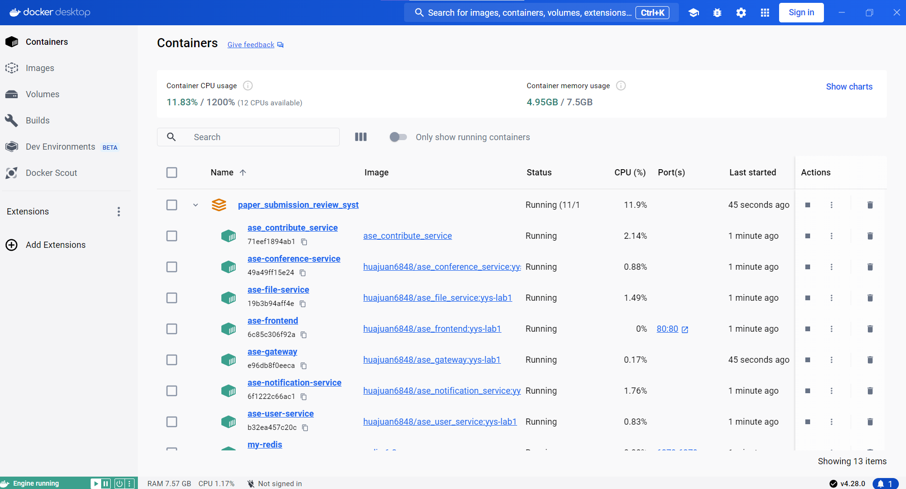
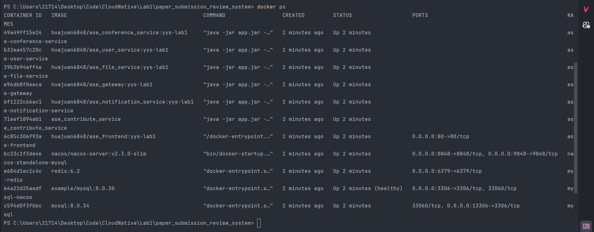
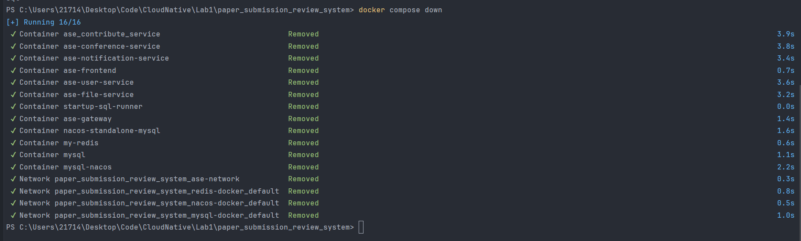

# Lab1 Group-8 Report

------

## （1）小组分工：

侯斌洋：任务3

臧佳俊：任务2-half

梁宇锋：任务1

路明畅：任务2-half 

------

## （2）Docker Hub 镜像地址

hby925/ase_contribute_service

```docker pull hby925/ase_contribute_service```


------

## （3）运行截图








------

## （4）实验过程记录

### 任务1:

1. 阅读投稿服务的相关代码，了解各模块的功能以及相互间的依赖关系。
2. 编写四个函数。
3. 启动中间件与投稿服务，进行前后端联调。
4. 使用其他组员提供的Dockerfile，将投稿服务打包成镜像，然后在本机创建容器与测试。
5. 使用其他组员提供的Dockercompose，在本机一键启动所有服务并测试。

发现的问题：投稿人投稿后，相关数据的持久化出错。具体为“将投稿时间转为字符串”时出错。  
原因：投稿时间设为LocalDateTime.now()，而SimpleDateFormatter对象不能将LocalDateTime对象转为字符串。  
解决：删除ContributeServiceImpl类中原来声明的SimpleDateFormatter对象，重新声明DateTimeFormatter对象，用DateTimeFormatter对将投稿时间转为字符串。  

### 任务2:

1. 注册Docker Hub账号，创建Repository。
2. 熟悉Dockerfile指令，进行Dockerfile编写与多阶段构建。
3. 构建并运行镜像，对镜像进行测试。
4. 将镜像推送到Docker Hub。

### 任务3:

1. 首先了解yaml文件的语法，避免出现格式错误
2. 学习Compose 模板文件，了解常用的关键字。
3. 编写docker-compose.yml文件，将中间件和服务的两个脚本都转换为service服务，并添加networks,volumes等配置。
4. 进行测试，通过docker-compose up -d启动服务，通过docker-compose down关闭服务。


------

## （5）实验总结

* 侯斌洋：
在lab1的实践过程中，学习了通过Dockerfile创建镜像，通过Docker Compose来管理多个容器。使用Docker，可以使应用的部署、分发都变得更加高效。

&emsp;
* 臧佳俊：
通过本次实践，了解了docker的基本用法，还有docker构建镜像并运行的过程，感受到了使用docker容器进行开发的高效性，但是仍有很多不足需要学习。

&emsp;
* 梁宇锋：
通过lab1的实践，我了解了从代码到镜像再到容器的全过程，对Dockerfile和Dockercompose的构建与作用有了更深的理解。我也体会到使用容器技术开发与部署服务的便利性和高效性。

&emsp;
* 路明畅：
通过本次实践，学习了对Dockerfile的编写，并理解了多阶段构建的重要性，加深我了对Docker容器化技术的整体理解。

&emsp;
