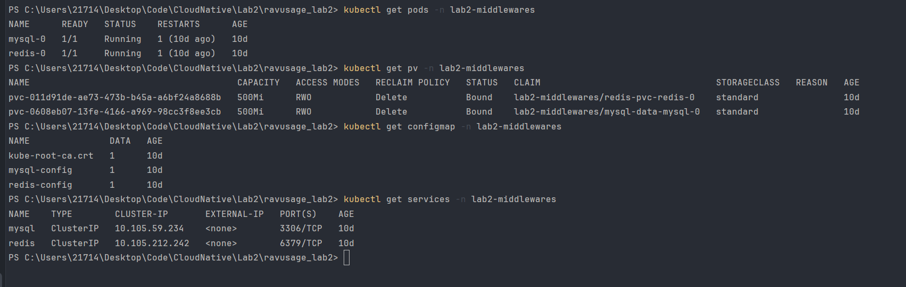
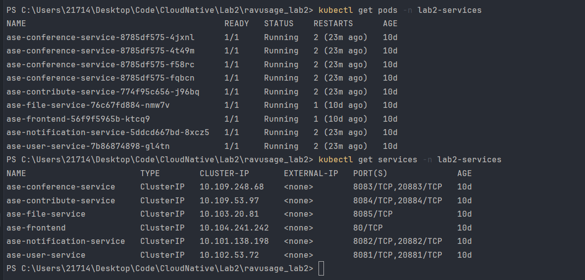
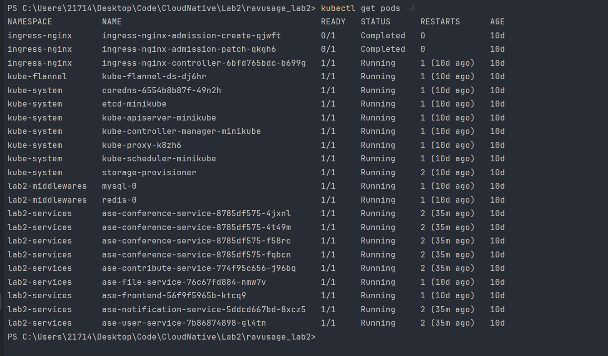
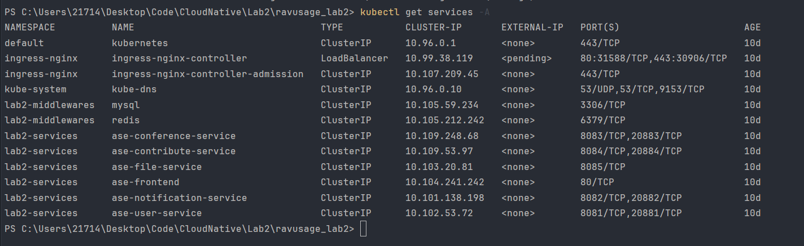
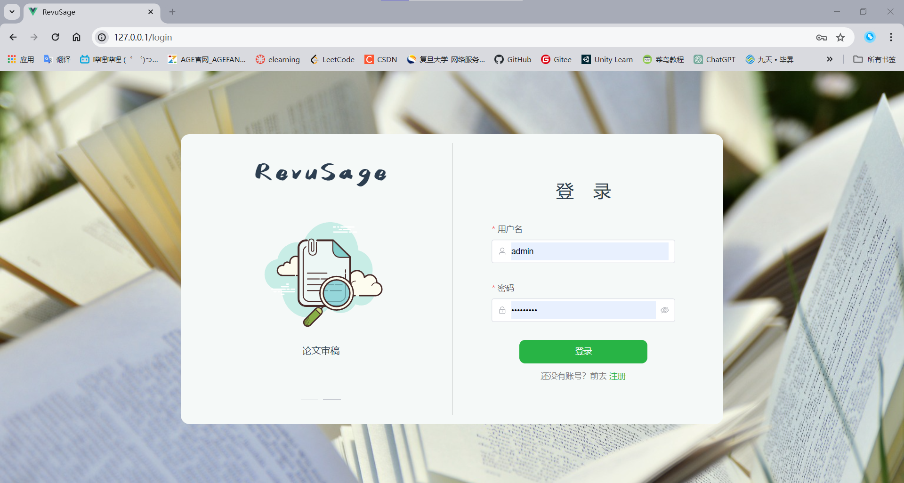
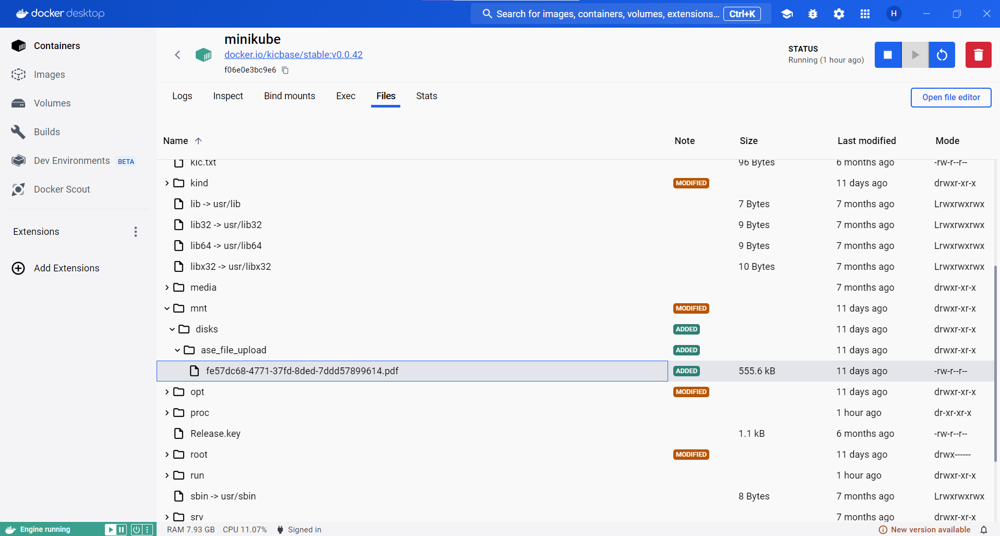
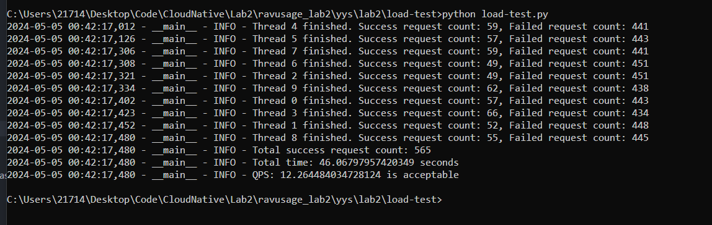

# 2024 Spring CloudNative Lab2

## 1. 小组分工

* 路明畅：部署 mysql、redis

* 梁宇锋：部署 service: user, notification, conference, contribute

* 臧佳俊：部署 service: file, frontend   +  ingress

* 侯斌洋：使用 helm chart 部署服务

## 2. Kubernetes 集群的搭建过程

### 2.1 部署中间件

* ``lab2-middlewares.yaml`` 为中间件部署文件。
* 使⽤ StatefulSet 部署 redis 和 mysql。
* 使⽤ ConfigMap 存储mysql时启动时的初始化sql脚本和redis的配置⽂件。
* 使⽤ Service 将mysql和redis的Pod暴露为ClusterIP服务，供其他服务访问。



### 2.2 部署服务

* ``lab2-services.yaml`` 为服务部署文件。
* 使⽤ Deployment 部署 user, notification, conference, contribute, file 服务。
* 使⽤ Service 暴露 user, notification, conference, contribute, file 服务的 http 和 rpc 端口。
* 使用 ConfigMap 存储 user, notification, conference, contribute, file 服务的配置文件，与上面中间件暴露的服务对应。
* 将 file 服务的数据存储在 minikube 节点的 /mnt/disks/ase_file_upload 目录下。
    ```yaml
    volumes:
    - name: upload-data
      hostPath:
        path: /mnt/disks/ase_file_upload
    nodeSelector:
    kubernetes.io/hostname: minikube
    ```

* 这里 conference 的 replica 为 4，其他服务的 replica 为 1。



### 2.3 部署 Ingress

* ``deploy.yaml`` 为 ingress 插件，可直接使用 ``kubectl apply -f deploy.yaml`` 安装。
* ``lab2-ingress.yaml`` 为 ingress 配置文件。
* 使⽤ Ingress 部署 ingress-nginx-controller。重写路径并转发请求。

## 3. yaml 文件和 Helm Chart 的使用方法。

### 3.1 yaml 文件

* 相关文件为：

> k8s_middlewares/..
> k8s_services/..
> k8s_ingress/..
> k8s_all/..


```shell
# 准备 minikube
docker context use default
minikube start --driver=docker --image-mirror-country=cn --kubernetes-version=v1.28.3 --memory=6144 --cni=flannel

# 使用 yaml 文件部署 k8s 集群，包含中间件、服务、ingress。
kubectl apply -f k8s_middlewares  # 部署中间件
kubectl apply -f k8s_services     # 部署服务   
kubectl apply -f k8s_ingress      # 部署ingress
# 或者可以利用 k8s 的 restart 机制，不考虑顺序，使用 kubectl apply -f k8s_all 一键部署。

# 检查节点状态
kubectl get pods -A               
# 端口映射，之后浏览器停用缓存且访问http://localhost:80即可运行。
kubectl port-forward svc/ingress-nginx-controller -n ingress-nginx 80:80  
```

### 3.2 Helm Chart

* 相关文件为：

> lab2-chart/..
> lab2-chart-0.1.0.tgz

```shell
# 准备 minikube
docker context use default
minikube start --driver=docker --image-mirror-country=cn --kubernetes-version=v1.28.3 --memory=6144 --cni=flannel

# 使用 yaml 文件部署中间件。
kubectl apply -f k8s_middlewares  # 部署中间件

# 使用 Helm Chart 部署服务和ingress。
helm install lab2-chart-0.1.0 ./lab2-chart-0.1.0.tgz

# 检查节点状态
kubectl get pods -A               
# 端口映射，之后浏览器停用缓存且访问http://localhost:80即可运行。
kubectl port-forward svc/ingress-nginx-controller -n ingress-nginx 80:80  
```

* values.yaml 如下：

```yaml
imageRepository:
    userService: huajuan6848/ase_user_service
    notificationService: huajuan6848/ase_notification_service
    conferenceService: huajuan6848/ase_conference_service
    contributeService: huajuan6848/ase_contribute_service
    fileService: huajuan6848/ase_file_service
    frontend: huajuan6848/ase_frontend

dockerTag:
  userService: yys-lab2
  notificationService: yys-lab2
  conferenceService: yys-lab2
  contributeService: yys-lab2
  fileService: yys-lab2
  frontend: yys-lab2

replicas:
  userService: 1
  notificationService: 1
  conferenceService: 4
  contributeService: 1
  fileService: 1
  frontend: 1

env: prod

frontEndPort: 80

fileServiceHostNode: minikube

fileServiceHostPath: /mnt/disks/ase_file_upload

mysql:
  host: mysql.lab2-middlewares.svc.cluster.local
  port: 3306
  user: root
  password: root

redis:
  host: redis.lab2-middlewares.svc.cluster.local
  port: 6379
```
* 支持以下配置：

1. 镜像仓库
2. 镜像版本
3. 服务副本数
4. 环境变量参数
5. 前端端口
6. 上传文件存储节点
7. 上传文件存储路径
8. mysql配置
9. redis配置

### 3.3 本地运行结果

* 无论是使用 3.1 还是 3.2 的部署方式，在本地运行均有如下输出：





* 浏览器访问 http://localhost:80，可以看到如下页面：



* 上传文件后，在minikube的如下路径可以看到上传的文件：



## 4. 服务扩容与负载均衡测试的过程与结果截图

### 4.1 服务扩容
* 通过设置 replica 为 4 实现

```yaml
apiVersion: apps/v1
kind: Deployment
metadata:
  name: ase-conference-service
  namespace: lab2-services
spec:
  replicas: 4
  selector:
    matchLabels:
      app: ase-conference-service
  template:
    metadata:
      labels:
        app: ase-conference-service
    spec:
      containers:
        - name: ase-conference-service
          image: huajuan6848/ase_conference_service:yys-lab2
          ports:
            - containerPort: 8083
            - containerPort: 20883
          envFrom:
            - configMapRef:
                name: service-config
```

### 4.2 负载均衡
* 通过 Ingress 实现

* 部署所有服务并暴露端口后，执行测试的截图：




## 5. 实验过程记录，遇到的问题和解决方法

### 5.1 实验过程记录

1. 学习 k8s https://kubernetes.io/zh-cn/docs/concepts/
2. 编写中间件配置文件并测试是否能够成功部署
3. 编写服务配置并测试是否能够成功部署
4. 编写ingress配置文件并测试是否能够成功部署
5. 修改服务配置文件，进行服务扩容
6. 学习 helm chart https://helm.sh/zh/docs/
7. 编写 helm chart 配置文件并测试是否能够成功部署
8. 完成实验报告。

### 5.2 遇到的问题和解决方法

#### 5.2.1 问题：mysql 容器启动时，无法执行 init.sql。
* 解决：将 init.sql 挂载的路径改为 /docker-entrypoint-initdb.d。
```yaml
volumeMounts:
- name: mysql-data
  mountPath: /var/lib/mysql
- name: mysql-config
  mountPath: /docker-entrypoint-initdb.d
  readOnly: true
```

#### 5.2.2 问题：mysql 经常报错 OOM (out of memory)。
* 解决：minikube 内存增加到 6144。
```shell
minikube start --driver=docker --image-mirror-country=cn --kubernetes-version=v1.28.3 --memory=6144 --cni=flannel
```

#### 5.2.3 问题：ingress 重写路径错误
* 解决：检查正则匹配，修改 ingress 文件。

#### 5.2.4 问题：端口映射后 http://localhost:80 仍无法访问
* 解决：需要浏览器停用缓存


## 6.每个小组成员单独的实验总结

### 6.1 侯斌洋

> 在本次lab中学习了 k8s 和 helm chart 的一些概念，并进行实践编写了配置文件，最后成功完成k8s集群的部署。在实验过程中遇到了很多问题，但在与张皓捷助教交流的过程中都得到了解决，再次感谢张助教的帮助。Kubernetes 提供了一个可弹性运行分布式系统的框架，并支持服务发现和负载均衡、存储编排、自动部署和回滚等功能，使得容器管理、维护和扩展变得更加轻松。

### 6.2 路明畅

> 通过这次lab，我深入理解了Kubernetes中StatefulSet的工作原理及其与无状态部署的Deployment的区别。同时，对Kubernetes的存储解决方案，如PersistentVolumes有了实际操作的体验。整体来说，本次lab不仅提高了我的实操能力，也加深了对Kubernetes作为容器编排工具强大功能的理解。

### 6.3 梁宇锋

> 通过完成部署四个服务的工作，我学到了如何使用 Kubernetes 进行容器化应用部署。关键的收获包括：
>
> 1. 命名空间的利用：命名空间有助于管理和隔离不同的项目，提高了资源管理的清晰度。
> 2. 配置管理的灵活性：使用 ConfigMap 分离配置信息和代码，使得配置管理更加灵活和可维护。
> 3. Deployment 和 Service 的运用：理解了 Deployment 和 Service 的作用，并学会了如何定义和使用它们。
> 4. 这次经验让我更深入地了解了 Kubernetes，并获得了一些实用的技能和经验，这对未来的工作将有很大帮助。

### 6.4 臧佳俊

> 通过本次实验，了解了ingress的运行机制，当外部请求到达集群的 Ingress 控制器时，控制器根据 Ingress 资源中定义的路径、主机名等信息，将请求转发到相应的服务。使得一个入口点可以管理多个服务的外部访问流量，无需为每个服务都配置独立的路由规则，并且可以通过配置Ingress资源来定义不同的路由规则以满足需求。

