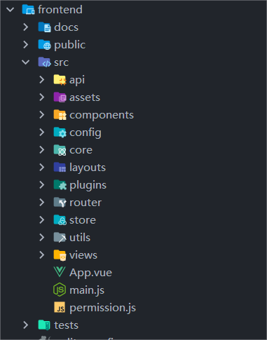
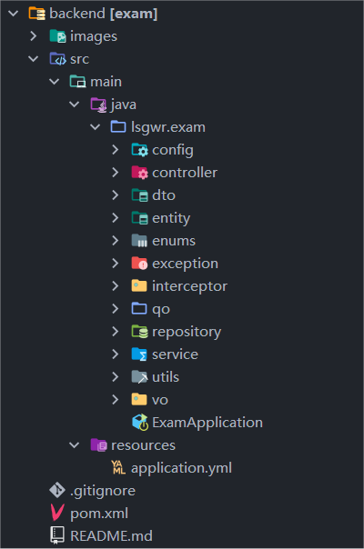
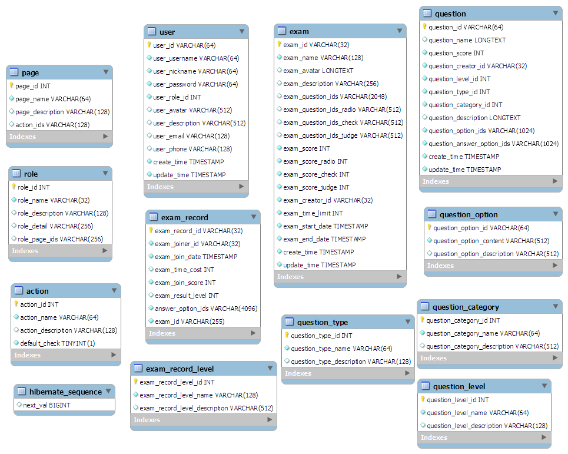
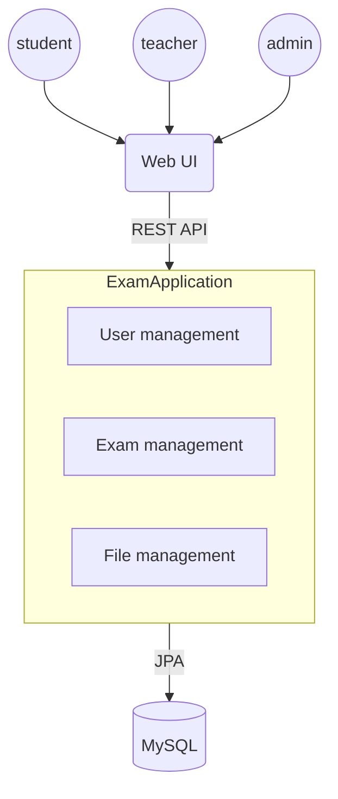

# lab3-task1-group-8

## 1. 功能

### 1.1 用户基本功能

+ 注册
+ 登录
+ 查看和修改个人信息
+ 支持学生、教师、管理员三种角色
  + 学生：参加考试和查看我的考试
  + 教师：学生的所有权限+创建/编辑题目+创建/编辑考试
  + 管理员：教师的所有权限+管理用户

### 1.2 考试展示和参加

+ 单选、多选、判断都能正常展示和参加考试做题
+ 计时和计分的功能

### 1.3 管理

+ 试题管理(单选、多选、判断的录入)
+ 考试管理(设置有效时间和给试卷组题)

## 2. 架构

### 2.1 前端

+ 前端为典型的 Vue 项目。

* `public`: 存放公共资源文件，如静态图片、样式文件等。

* `src`: 源代码。
  - `api`: 存放与后端交互的接口，包括考试相关的接口和用户相关的接口。
  - `assets`: 存放项目静态资源文件，如图片、图标等。
  - `components`: 存放项目的可复用组件。
  - `config`: 存放项目配置文件，包括路由配置、项目默认配置项。
  - `core`: 用于导入一些库并注册Vue.js插件。
  - `layouts`: 存放布局组件，包括基础页面布局，用户界面布局，空界面布局等。
  - `plugins`: 存放插件。
  - `router`: 路由配置文件。
  - `store`: 存放 Vuex 状态管理相关文件。
  - `utils`: 存放工具文件。
  - `views`: 存放页面级组件，即每个路由对应的页面。
    - `account`: 账户相关页面。
      - `settings`: 设置页面。
    - `dashboard`: 工作区页面。
    - `exception`: 异常页面。
    - `home`: 首页。
    - `list`: 考试相关的页面，包括考试卡片列表界面，考试细节界面，考试记录界面等。
    - `test`: 测试页面。
    - `user`: 用户登录、注册相关的页面。

* 其他根目录下的大部分为配置文件。

### 2.2 后端

+ 后端为Springboot 单体应用架构

* `config`：存放项目的配置文件，具体为：Swagger2的配置、拦截器配置、跨域配置等。
* `controller`：存放控制器类，负责接收 HTTP 请求并调用对应的服务进行处理，然后返回响应给客户端。
* `dto`：存放数据传输对象（DTO），用于封装前端和后端的数据交互，是 Controller 和 Service 之间数据传递的载体。
* `entity`：存放实体类，用于映射数据库中的表结构，使用 JPA 进行对象关系映射（ORM）。
* `enums`：存放枚举类，具体为：用户账号类型、问题类型、错误码，用户类型。
* `exception`：存放异常类，用于封装异常信息，统一处理异常并返回给前端
* `interceptor`：存放拦截器类，用于拦截 HTTP 请求并在处理之前或之后执行操作。
* `qo`：存放查询对象，具体为：下载文件的路径、登录的查询参数、文件传输的实体类。
* `repository`：存放数据访问层接口，用于定义数据访问的方法，使用 JPA 持久层框架。
* `service`：存放服务接口，定义业务逻辑的接口方法，实现了控制器和数据访问层之间的解耦。
* `utils`：存放工具类，具体为：文件传输工具类、文件传输类、JWT工具类、返回消息类。
* `vo`：存放视图对象，类似于 DTO，用于封装返回给前端的数据。
* `resources`： 资源文件目录
* `pom.xml`：Maven 项目管理工具的配置文件，用于管理项目的依赖。

### 2.3 数据库

+ 数据库采用`MySQL`，数据库表如下（由MySQL Workbench生成）：

* `action`: 存储前端页面操作的权限信息，如新增、查询、详情等操作。
* `exam`: 存储考试的详细信息，包括考试名称、时间限制、题目等。
* `exam_record`: 记录用户的考试记录，包括参与者ID、考试时间、得分等。
* `exam_record_level`: 存储考试结果的等级信息，如优秀、良好、及格等。
* `page`: 存储前端页面的信息，包括页面名称、描述以及对应的操作权限列表。
* `question`: 存储考试题目的信息，包括题目名称、分数、选项等。
* `question_category`: 存储题目类别的信息，如数学、英语、政治等。
* `question_level`: 存储题目难易度级别的信息，如难、中、易。
* `question_option`: 存储题目选项的信息，用于题目的答案解析。
* `question_type`: 存储题目类型的信息，如单选、多选、判断等。
* `role`: 存储用户角色的信息，包括角色名称、描述、可访问页面等。
* `user`: 存储用户信息，包括用户名、密码、角色、头像等。

### 2.4 通信

+ 前端和后端的通信采用`RESTful API`，前端通过`axios`发送请求，后端通过`SpringBoot`接收请求并返回数据。有如下API:
  - `/api/user`: 用户相关API
    - `/api/user/register`: 注册
    - `/api/user/login`: 根据用户名或邮箱登录,登录成功返回token
    - `/api/user/user-info`: 获取用户信息
    - `/api/user/info`: 获取用户的详细信息，包括个人信息页面和操作权限
  - `/api/exam/`: 考试相关API
    - `/api/exam/question/all`: 获取所有问题的列表
    - `/api/exam/question/update`: 更新问题
    - `/api/exam/question/create`: 创建问题
    - `/api/exam/question/selection`: 获取问题分类的相关选项
    - `/api/exam/question/detail/{id}`: 根据问题的id获取问题的详细信息
    - `/api/exam/all`: 获取全部考试的列表
    - `/api/exam/question/type/list`: 获取问题列表，按照单选、多选和判断题分类返回
    - `/api/exam/create`: 创建考试
    - `/api/exam/update`: 更新考试
    - `/api/exam/card/list`: 获取考试列表，适配前端卡片列表
    - `/api/exam/detail/{id}`: 根据考试的id，获取考试详情
    - `/api/exam/finish/{examId}`: 根据用户提交的答案对指定id的考试判分
    - `/api/exam/record/list`: 获取当前用户的考试记录
    - `/api/exam/record/detail/{recordId}`: 根据考试记录id获取考试记录详情
  - `/api/file`: 文件相关API
    - `/api/file/api/upload/singleAndparas`: 单文件上传，支持同时传入参数。
    - `/api/file/upload/single/model`: 单文件上传，支持同时传入参数，使用模型。
    - `/api/file/upload/multiAndparas`: 多文件上传，支持同时传入参数。
    - `/api/file/upload/multi/model`: 多文件上传，支持同时传入参数，使用模型。
    - `/api/file/download/get`: Get方式下载文件。
    - `/api/file/download/post`: Post方式下载文件。

+ 后端与数据库的通信采用`JPA`，通过`Spring Data JPA`实现对数据库的增删改查操作。

### 2.5 总览

+ 前端通过`Vue`框架构建用户界面，使用`AntDesign`提供的基础 UI 组件。
+ 后端通过`SpringBoot`框架构建应用程序，使用`JPA`实现对象关系映射，使用`Swagger2`设计、构建和文档化`RESTful API`，使用`JWT`实现用户认证和授权。
+ 数据库采用`MySQL`。
+ 前端和后端通过`RESTful API`进行通信，后端与数据库通过`JPA`进行通信。
+ 整体为传统的单体架构，所有服务器端功能实现为一个单体应用，除数据库之外的业务组件之间均通过本地调用来实现交互。
+ 架构图如下：

## 3. 技术栈

### 3.1 前端

+ Vue: 用于构建用户界面的 JavaScript 框架
+ AntDesign: 提供丰富的基础 UI 组件

### 3.2 后端

+ SpringBoot: 用于快速开发基于 Spring 框架的应用程序的开源框架。
+ JPA: 对象关系映射的一组规范，用于将entity映射到数据库表
+ Swagger2: 用于设计、构建和文档化RESTful API的开源工具集
+ JWT: JSON Web Token，一种开放标准（RFC 7519），用于在网络应用间传递声明

### 3.3 数据库

+ MySQL: 开源关系型数据库管理系统

## 4. 拆分成微服务

### 4.1 问题1：应该拆分为多少个微服务？

> 如果是按照 controller 中分的模块来拆分，可以拆分成用户管理、考试管理、文件管理三个微服务。
> 然而实际上，问题管理是相对独立的一个服务，其与考试管理并不严格绑定。
> 此外，为了解耦，应将文件管理服务拆分到考试服务和用户服务中。
> 考虑到考试执行和考试管理相对也是独立的，因此考试服务也应该拆分为考试管理和考试执行两个微服务。
> 因此，我们认为应该拆分为用户管理、考试管理、考试执行、问题管理四个微服务。

### 4.2 问题2：目前单体架构应用中存在一些通用的配置，如Swagger2的配置以及返回消息的定义，拆分后如何处理？

> 将多个服务共享的通用功能打包成共享类库，或者进行拆分，将这些配置加到用到的服务中。出于松耦合的考虑，个人认为第二种方法更佳。

### 4.3 问题3：在使用一个服务时需要用到另一个服务的数据，如考试服务需要用到问题服务的数据，如何处理？

> 采用API组合模式，在前端设计API Composer. 后端进行重构使得微服务间尽可能独立，从而能够并行地调用相关服务以缩短查询操作响应时间。

### 4.4 问题4：各微服务独立管理数据，可能导致跨服务的数据一致性问题，如何解决？

> 本次lab计划采用 CQRS 模式，对于每个服务将读写分离，使用不同的数据库进行存储。CQRS架构从命令端发布事件到查询端处理事件并更新视图之间存在延迟，查询端视图可能存在滞后，由此可能导致客户端查询时出现不一致。
> 解决方案：可以将命令作为事务进行处理，在接收到命令时首先广播到相关的数据库，在处理命令时所有相关的数据库均不可进行查询。这样可能会增加查询时的延迟，但可以尽可能保证数据一致性。在查询操作远多于命令的情况下，这种方式是可行的。

