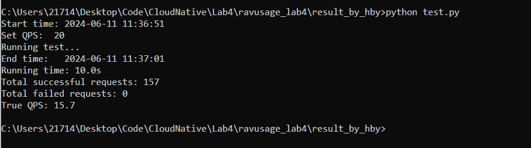
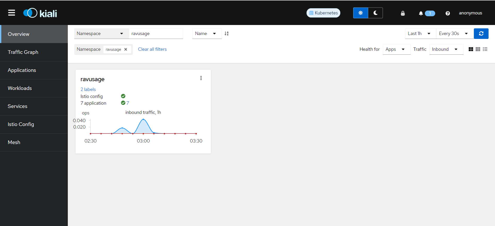
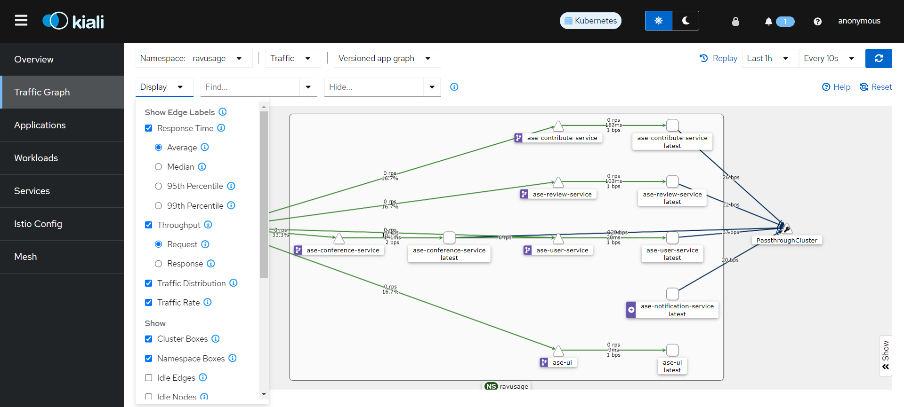
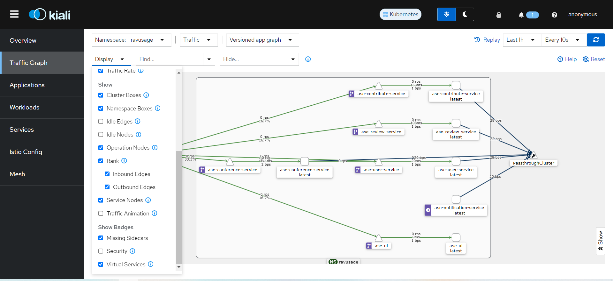
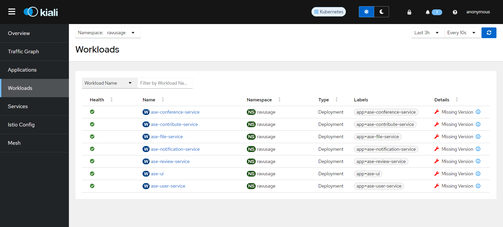
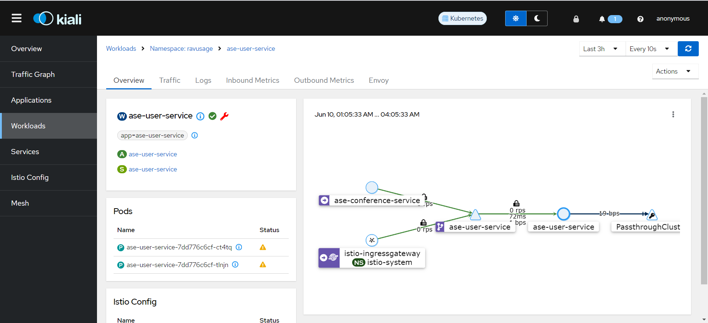
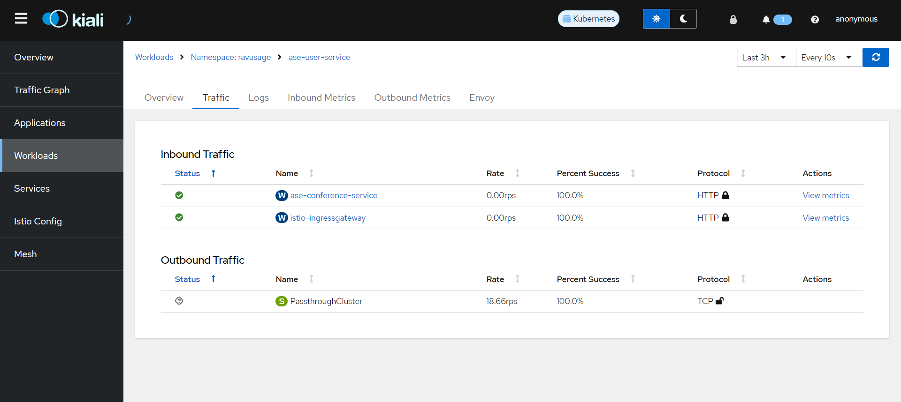
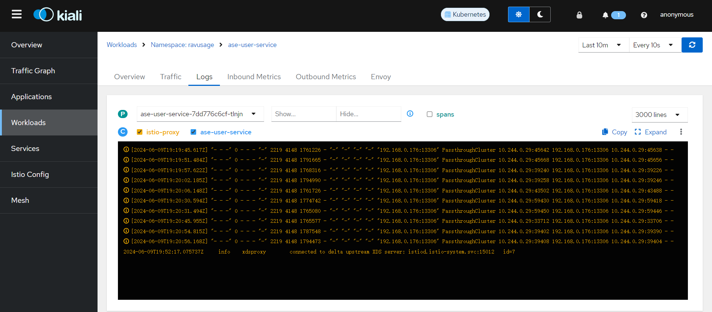

# 2024 Spring CloudNative Lab4

## 1. 运行（Windows Docker Minikube）

```shell
# 1. 下载Istio并添加bin目录到path

# 2. 设置docker context
docker context use default

# 3. 运行一次即可，删除之前lab2的集群
minikube delete

# 4. 创建一个新的minikube集群
minikube start --driver=docker --image-mirror-country=cn --kubernetes-version=v1.28.3 --memory=6144

# 5. 安装istio到新的minikube集群
istioctl install --set profile=demo -y

# 6. 启动中间件
docker compose -f lab4/middlewares-docker/mysql-docker/docker-compose.yaml up -d
docker compose -f lab4/middlewares-docker/redis/docker-compose.yml up -d
docker compose -f lab4/middlewares-docker/seata/docker-compose.yml up -d

# 7. 部署应用
kubectl create namespace ravusage
kubectl label namespace ravusage istio-injection=enabled
# windows 使用 ipconfig 命令查看 Wireless LAN adapter WLAN: 的 Ipv4地址并修改 ravusage-config.yml
kubectl apply -f lab4/yamls

# 8. 检查pods是否正常运行，正常情况下所有pod都应该是 Running 状态且不会频繁 RESTART
kubectl get pods -n ravusage

# 9. 将Istio的Ingress Gateway暴露到本地端口。
kubectl port-forward -n istio-system svc/istio-ingressgateway 8080:80

# 10. 浏览器停用缓存并访问 http://localhost:8080 查看是否正常运行

# 11. 部署 Prometheus Grafana Kiali
kubectl apply -f tools

# 12. 验证Prometheus Grafana Kiali 是否正常运行
kubectl get pods -n istio-system

# 13. Prometheus：用于收集和查询Istio指标。
kubectl port-forward svc/prometheus -n istio-system 9090:9090
# 访问 http://localhost:9090

# 14. Grafana：用于可视化Istio指标。
kubectl port-forward svc/grafana -n istio-system 3000:3000
# 访问 http://localhost:3000

# 15. Kiali：用于服务网格的可视化和监控。
kubectl port-forward svc/kiali -n istio-system 20001:20001
# 访问 http://localhost:20001

# issues
# 若仅有review启动失败，则删除之前的volume并重启mysql，然后重启review。因为若有volume存在则mysql不会执行初始化脚本
docker compose -f lab4/middlewares-docker/mysql-docker/docker-compose.yaml down -v
docker compose -f lab4/middlewares-docker/mysql-docker/docker-compose.yaml up -d
kubectl delete pod -n ravusage -l app=ase-review-service
# 重启某个pod
kubectl delete pod -n ravusage -l app=ase-user-service
# 查看某个pod的日志
kubectl logs -n ravusage -l app=ase-user-service
```

## 2. 基于 istio 和 kiali 实现微服务的可观测性和流量管理。

### 2.1 实验准备

1. 安装 Istio
2. 运行微服务系统
3. 部署 Kiali
4. 学习如何使用 Kiali  https://kiali.io/docs

* 检测是否完成实验条件

    ```shell
    # 检查是否安装 Istio
    kubectl get pods -n istio-system
  
    # 检查集群pod
    kubectl get pods -n ravusage
  
    # 检查是否成功部署微服务系统
    kubectl port-forward -n istio-system svc/istio-ingressgateway 8080:80
    # 浏览器停用缓存并访问 http://localhost:8080 需正确显示前端界面。
  
    # 检查是否成功部署 Kiali
    kubectl get pods -n istio-system
    kubectl port-forward svc/kiali -n istio-system 20001:20001
    # 浏览器停用缓存并访问 http://localhost:20001 需正确显示 Kiali 界面。
    ```

### 2.2 可观测性

1. 参考lab2中对于负载均衡的测试代码，编写python文件，模拟用户访问服务。
2. 每次运行后，查看kiali中的各项指标并记录。

* 分工： 一人负责 "/contribute" ，一人负责 "/contribute/listByName/{username}"。
* 关于模拟用户访问：
  1. 访问服务的哪个接口
     1. "/contribute"
     2. "/contribute/listByName/{username}"

  2. 每秒访问多少次：根据不同值的QPS进行尝试并选出 1 个典型的数字（两人商量）。
  3. 每次运行多长时间：10s

* 关于记录：
  1. Run test
    * 记录每次运行的时间，以及每次运行的QPS
    
  2. Overview (注意过滤 ravusage，以及调整 Last 1h 为上次测量的时间， Every 10s固定不变)
    * 记录overview图片
    
  3. Traffic Graph (注意各个选项保持一致，以及调整 Last 1h 为上次测量的时间， 若中间的图无法展示全部信息，可以鼠标滚轮放大，以及拖拽节点)
    * 记录traffic graph图片
    
    
  4. Workloads(调整 Last 1h 为上次测量的时间， Every 10s固定不变))
    * 记录类似下面的一张图片
    
    * 以及对于每个相关的服务，记录类似下面的3张图片
    
    
    

### 2.3 流量管理

1. 根据需要修改 replicas ，目前 frontend 和 file 的 replicas 为 1，其他服务为 2。
2. 使用VirtualService和DestinationRule来进行请求路由。
3. 编写 python 文件，模拟用户访问服务（访问什么服务，每分钟多少次，运行多长时间）。
4. 每次运行后，查看kiali中的流量路由情况并记录。

* 分工： 一人负责 "/contribute"，small flow，一人负责 "/contribute"，large flow。
* 关于模拟用户访问：
    1. 访问服务的哪个接口："/contribute"
    2. 每秒访问多少次：根据不同值的QPS进行尝试并选出 2 个典型的数字（两人商量）。
       1. small flow
       2. large flow
    3. 每次运行多长时间：10s

* 关于记录：
    1. Run test
       * 记录每次运行的时间，以及每次运行的QPS
         
    2. Overview (注意过滤 ravusage，以及调整 Last 1h 为上次测量的时间， Every 10s固定不变)
       * 记录overview图片
         
    3. Traffic Graph (注意各个选项保持一致，以及调整 Last 1h 为上次测量的时间， 若中间的图无法展示全部信息，可以鼠标滚轮放大，以及拖拽节点)
       * 记录traffic graph图片
         
         
    4. Workloads(调整 Last 1h 为上次测量的时间， Every 10s固定不变))
       * 记录类似下面的一张图片
         
       * 以及对于每个相关的服务，记录类似下面的3张图片
         
         
         