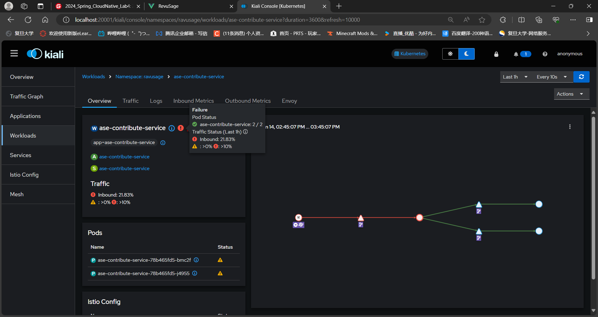
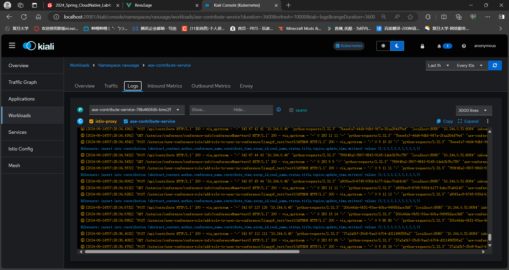
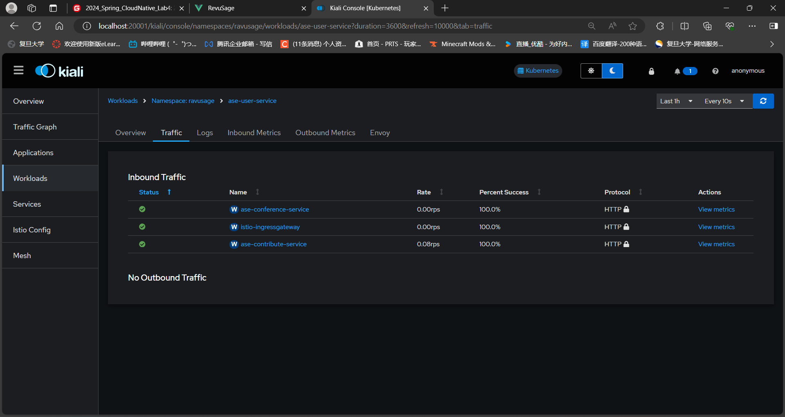
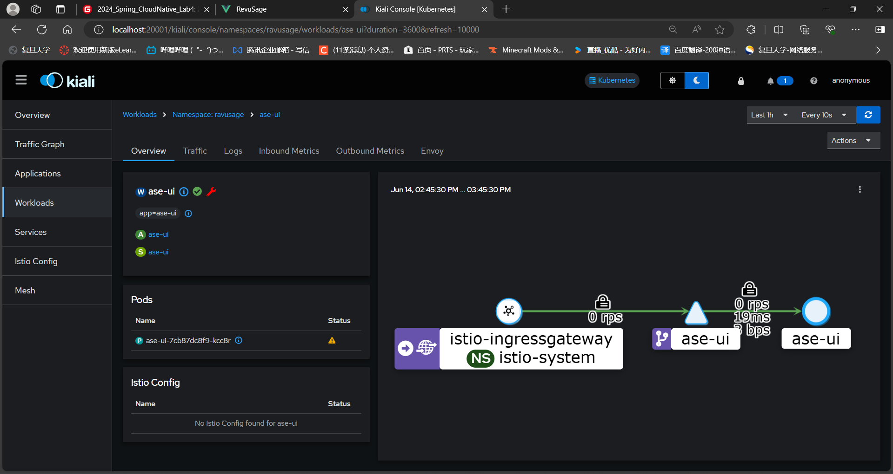
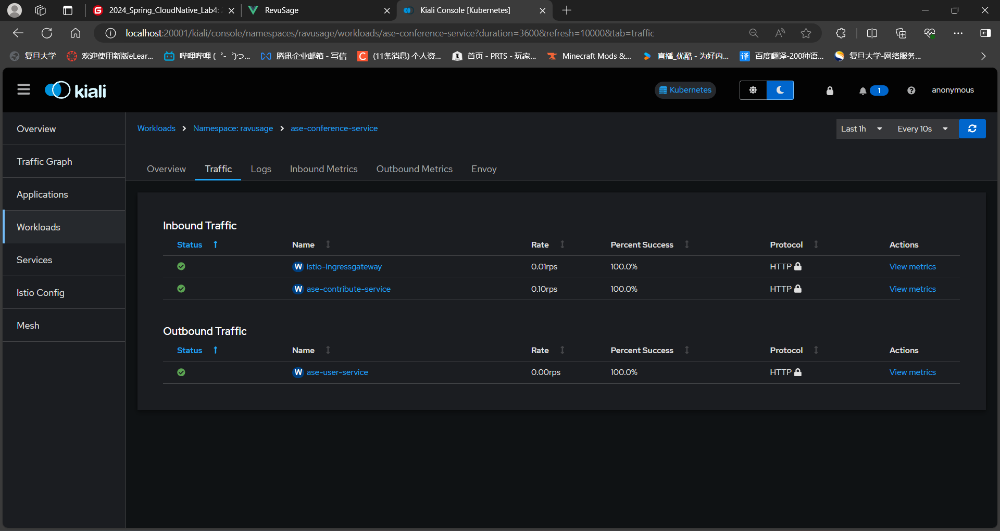

# 2024 Spring CloudNative Lab4

## 1. 实验设计

> 基于 istio 和 kiali 实现微服务的可观测性和流量管理

### 1.1 实验准备

1. 安装 Istio
2. 运行微服务系统
3. 部署 Kiali
4. 学习如何使用 Kiali  https://kiali.io/docs

* 检测是否完成实验条件
    ```shell
    # 检查是否安装 Istio
    kubectl get pods -n istio-system
    
    # 检查集群pod
    kubectl get pods -n ravusage
    
    # 检查是否成功部署微服务系统
    kubectl port-forward -n istio-system svc/istio-ingressgateway 8080:80
    # 浏览器停用缓存并访问 http://localhost:8080 需正确显示前端界面。
    
    # 检查是否成功部署 Kiali
    kubectl get pods -n istio-system
    kubectl port-forward svc/kiali -n istio-system 20001:20001
    # 浏览器停用缓存并访问 http://localhost:20001 需正确显示 Kiali 界面。
    ```

### 1.2 可观测性实验设计

1. 编写python文件，模拟用户访问服务。
2. 每次运行后，查看kiali中的各项指标并记录。

* 关于模拟用户访问：
    1. 访问服务的哪个接口：
        1. "/contribute"
        2. "/contribute/listByName/{username}"

    2. 每秒访问多少次：Set QPS = 20, 实际运行时 QPS 可能会略小。
    3. 每次运行多长时间：10s

### 1.3 流量管理实验设计

1. 创建ase-contribute-service-v2，修改 ase-gateway 配置，为 contribute 服务进行流量分配。
    ```yaml
   - match:
       - uri:
           prefix: /api/contribute
     rewrite:
       uri: /contribute
     route:
       - destination:
           host: ase-contribute-service
           port:
             number: 8084
         weight: 30
       - destination:
           host: ase-contribute-service-v2
           port:
             number: 8084
         weight: 70
   ```
2. 编写 python 文件，模拟用户访问服务。
3. 每次运行后，查看kiali中的流量路由情况并记录。

* 关于模拟用户访问：
    1. 访问服务的哪个接口："/contribute/listByName/{username}"
    2. 每秒访问多少次：。
        1. low： Set QPS = 20
        2. high： Set QPS = 200
    3. 每次运行多长时间：10s

<div STYLE="page-break-after: always;"></div>

## 2. 可观测性实验结果

### 2.1 Get: /contribute/listByName/{username}

1. 运行 python 文件，模拟用户访问服务。

2. 查看 kiali 中的 OverView。

3. 查看 kiali 中的 Traffic Graph 情况。

4. 查看 kiali 中的 Workloads 整体运行情况。

5. 查看 contribute service 的 Workload 情况。
   1. 查看 overview。
    
   2. 查看 traffic。 
    
   3. 查看 log。
    
6. 查看 user service 的 Workload 情况。
   1. 查看 overview。
    
   2. 查看 traffic。 
    
   3. 查看 log。
    

* 总结：
> 系统正常运行。
> 通过使用 kiali 可以清晰地看到流量分布情况，以及各个服务的运行情况，便于运维人员进行监控和优化。
> 通过查看 log 可以看到各个服务的日志信息，便于开发人员进行测试和优化。

<div STYLE="page-break-after: always;"></div>

### 2.2 Post: /contribute

1. 运行 python 文件，模拟用户访问服务。

2. 查看 kiali 中的 OverView。

3. 查看 kiali 中的 Traffic Graph 情况。

4. 查看 kiali 中的 Workloads 整体运行情况。

5. 查看 contribute service 的 Workload 情况。
   1. 查看 overview。
    
   2. 查看 traffic。 
    
   3. 查看 log。
    
6. 查看 user service 的 Workload 情况。
    1. 查看 overview。
     
    2. 查看 traffic。 
     
    3. 查看 log。
     
7. 查看 ui service 的 Workload 情况。
    1. 查看 overview。
     
    2. 查看 traffic。 
     
    3. 查看 log。
     
8. 查看 conference service 的 Workload 情况。
    1. 查看 overview。
     
    2. 查看 traffic。 
     
    3. 查看 log。
     

* 总结：
> 由于 Post 接口需要上传数据，Set QPS = 20 貌似有点过大了，导致部分失败的请求，contribute 的成功率仅有 82.8%。
> 其他服务均正常运行。
> 通过使用 kiali 可以实时监控服务的运行情况，并掌握目前系统的运行状态。
> 上面的服务异常情况可以通过 kiali 很快地发现，便于开发运维人员进行处理。

<div STYLE="page-break-after: always;"></div>

## 3. 流量管理实验结果

### 3.1 low flow

1. 运行 python 文件，模拟用户访问服务。

2. 查看 kiali 中的 Traffic Graph 情况。

3. 查看 kiali 中的 Workloads 整体运行情况。

4. 查看 contribute service v1 的 Workload 情况。

5. 查看 contribute service v2 的 Workload 情况。


* 总结：
> 系统正常运行。
> 在低QPS的情况下，流量分配正常，v1 和 v2 的流量比例为 3:7。
> 通过使用 istio 的 VirtualService 可以很方便地进行流量分配，便于运维人员进行流量控制。
> 通过使用 kiali 可以实时监控服务的运行情况，掌握流量的分布情况。

<div STYLE="page-break-after: always;"></div>

### 3.2 high flow

1. 运行 python 文件，模拟用户访问服务。

2. 查看 kiali 中的 Traffic Graph 情况。

3. 查看 kiali 中的 Workloads 整体运行情况。

4. 查看 contribute service v1 的 Workload 情况。

5. 查看 contribute service v2 的 Workload 情况。


* 总结：
> 系统正常运行。
> 在高QPS的情况下，流量分配正常，v1 和 v2 的流量比例为 3:7。
> 通过使用 istio 的 VirtualService 可以很方便地进行流量分配，便于运维人员进行流量控制。
> 通过使用 kiali 可以实时监控服务的运行情况，掌握流量的分布情况。

