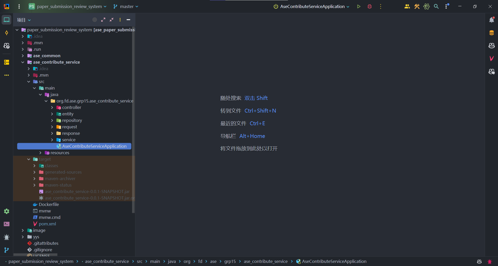
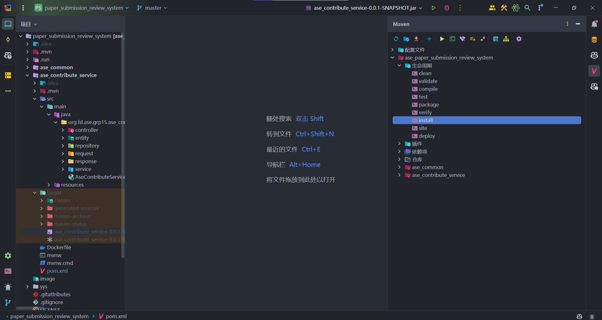

# 2024 春 云原生软件技术 lab1

## 小组分工：

&#x2714; 侯斌洋：任务3 

&#x2714; 臧佳俊：任务2-half 

&#x2714; 梁宇峰：任务1 

&#x2714; 路明畅：任务2-half 

## 其他：

1. ase_contribute-service 在构建运行时使用 jdk17 ，jdk21会报错。
2. windows 使用 docker desktop 需要开启HyperV，而 HyperV 与 VMware Workstation 以及大部分安卓模拟器不兼容。故若使用了这些软件则 HyperV 默认为关闭或隐藏。
3. windows 下可以通过 git bash 运行脚本。
4. 第一次运行中间件以及服务（即那两个脚本）时，尽量挂梯子。
5. 运行中间件时，若仅naco运行失败，可能是本地的mysql占用了3306端口，需要关闭本地mysql进程
6. 已添加IDEA的运行配置到./run下，打开IDEA应该能在右上角看见配置AseContributeServiceApplication，直接运行即可。运行前需要先运行中间件，经测试可以正常运行。

7. IDEA点击右侧的maven图标出现下图所示界面，点击clean可清除target目录下的jar包，点击install可重新打包。

8. 项目根目录下运行 ```docker compose up -d```可一键启动中间件及所有服务。运行```docker compose down```即可关闭所有服务。
9. 上传的论文文件挂载到```./yys/PaperFile```下。