# lab3-task2-group-8

## 1. 拆分为微服务

* 如何拆分？

> lab3-task1-group-8
> 4.1 问题一
> 如果是按照 controller 中分的模块来拆分，可以拆分成用户管理、考试管理、文件管理三个微服务。
> 然而实际上，问题管理是相对独立的一个服务，其与考试管理并不严格绑定。
> 此外，为了解耦，应将文件管理服务拆分到考试服务和用户服务中。
> 因此，我认为应该拆分为用户管理、考试管理、问题管理三个微服务。

* 将原有的单体应用拆分为3个微服务，包括：
  * 用户服务
  * 考试服务
  * 问题服务

### 1.1 用户服务

* `user_service`: 用户服务负责用户的注册、登录、个人信息查看修改等操作


### 1.2 考试服务

* `exam_service`: 考试服务负责考试的创建、更新、展示和参加


### 1.3 问题服务

* `question_service`: 问题服务负责问题的创建、更新、展示和回答

## 2. 实现服务间通信

* 使用基于容器云的微服务架构，服务部署在容器中，使用Kubernetes进行管理。
* 使用同步的基于RPC的通讯，使⽤Dubbo作为RPC框架。
* 利用Kubernetes的Service资源将每个微服务的Pod暴露为ClusterIP服务，并声明http和rpc端口，供其他服务访问

* 例：下面为考试服务的实现，其中调用了问题服务的接口。
```java
@Service
public class ExamServiceImpl {
    @DubboReference(check = false, providedBy = "question_service", providerNamespace = "lab3-services", providerPort = 20881)
    private IQuestionService iQuestionService;
    //...
}
```
* 在调用 `iQuestionService` 时，会通过 [question_service.lab3-services.svc.cluster.local:20881]() 的地址进⾏RPC调⽤。
* 之后 [question_service.lab3-services.svc.cluster.local:20881]() 会被k8s提供的DNS解析服务解析为 `question_service` 服务的ClusterIP地址。
* 随后，通过负载均衡器，请求会被转发到 `question_service` 服务的⼀个Pod上。

## 3. 实现服务注册与发现

* Kubernetes 使用 DNS 作为服务注册表。每个 Kubernetes 服务都会自动注册到集群DNS（CoreDNS）之中。
* 通过对集群DNS的查询来实现服务发现。

* 例：下面为考试服务与问题服务的注册与发现
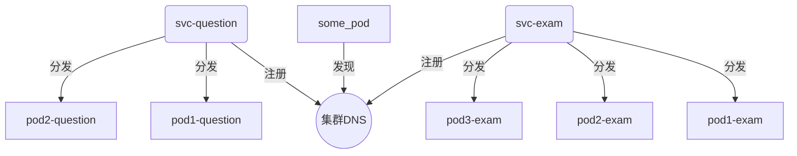

* `exam_service` 和 `question_service` 服务注册到集群DNS中。
* `some_pod` 可以通过集群DNS查询 `question_service` 的地址，得到 `question_svc` 的ClusterIP地址。
* `question_svc` 的请求会被负载均衡器分发到 `question_1` 或 `question_2` 的Pod上。

## 4. 每个服务的数据存储

### 4.1 用户服务

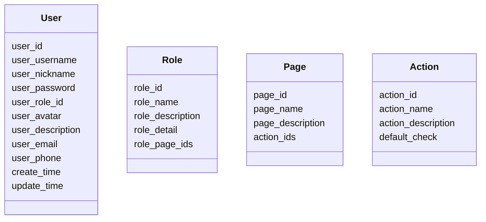

### 4.2 考试服务

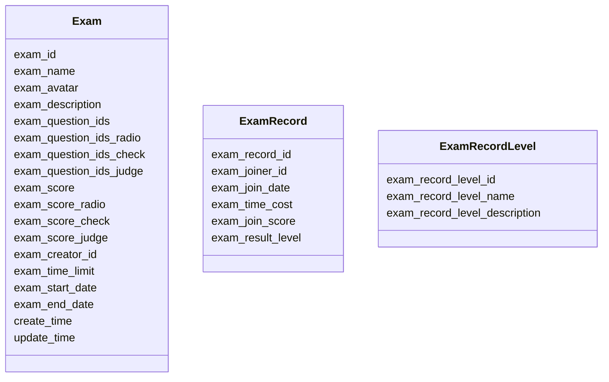

### 4.3 问题服务

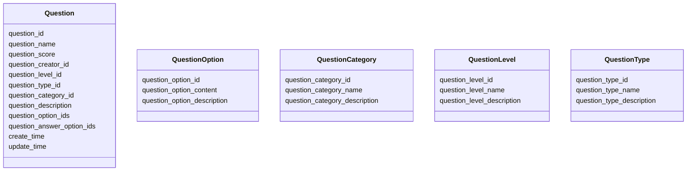

### 4.4 分布式存储可能带来的问题

* 本次lab计划采用CQRS模式，对于每个服务将读写分离，使用不同的数据库进行存储。
* CQRS架构从命令端发布事件到查询端处理事件并更新视图之间存在延迟，查询端视图可能存在滞后，由此可能导致客户端查询时出现不一致。
* 将命令作为事务进行处理，在接收到命令时首先广播到相关的数据库，在处理命令时所有相关的数据库均不可进行查询。
* 这样可能会增加查询时的延迟，但可以尽可能保证数据一致性。在查询操作远多于命令的情况下，这种方式是可行的。

## 5. 微服务类的设计

### 5.1 用户服务

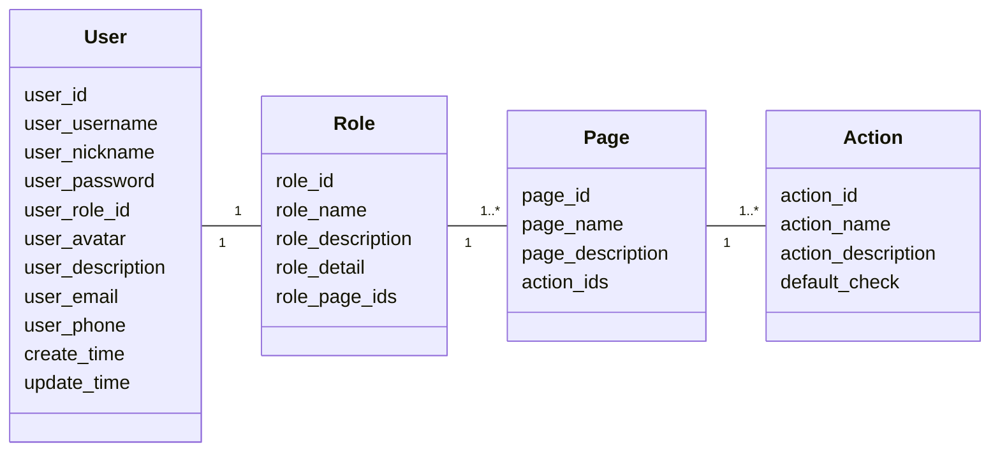

### 5.2 考试服务

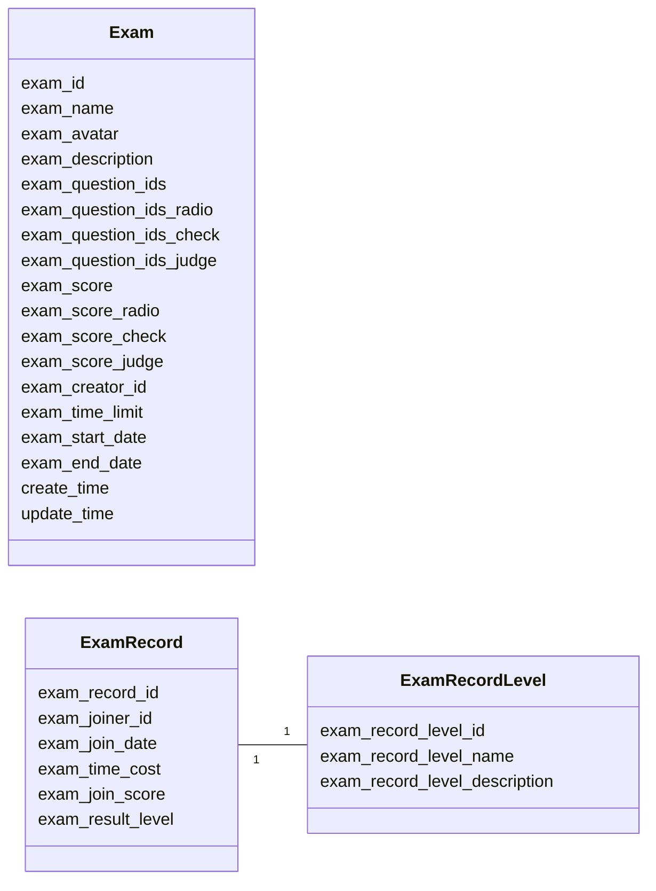

### 5.3 问题服务

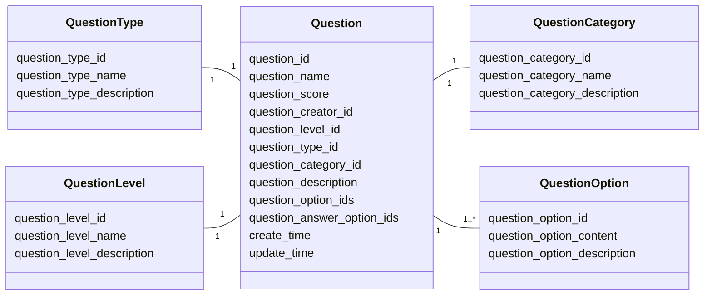

## 6. 微服务的内部外部接口设计

* 外部接口：利用Kubernetes的Ingress资源，重写路径并将请求转发到对应的服务。外部接口主要用于实现功能。
* 内部接口：利用Kubernetes的Service资源，使用Dubbo的RPC框架，通过RPC调用服务间的接口。内部接口主要向其他服务提供数据，以及发送事件。


### 6.1 用户服务
* 外部接口:
  - `/api/user/register`: 注册。 参数为：**用户名、密码、邮箱、电话等**。
  - `/api/user/login`: 登录。参数为：**用户名或邮箱、密码**。
  - `/api/user/user-info`: 获取用户信息。参数为：**用户id**。
  - `/api/user/info`: 获取用户的详细信息，包括个人信息页面和操作权限。参数为：**用户id**。
  - `/api/user/upload`: _上传用户信息相关文件，如头像_。参数为：**用户id和文件**。
* 内部接口:
  - `/api/user/get/{id}`: 获取某个用户的详细信息。参数为：**用户id**。
  - `/api/user/get_all`: 获取所有用户的列表。参数为：**空**。
  - `/api/user/get_role/{id}`: 获取某个用户的角色信息。参数为：**用户id**。


### 6.2 考试服务
* 外部接口:
  - `/api/exam/all`: 获取全部考试的列表。参数为：**空**。
  - `/api/exam/create`: 创建考试。参数为：**用户id、考试名称、时间限制、题目等**。
  - `/api/exam/update`: 更新考试。参数为：**用户id、考试id和需要更新的信息**。
  - `/api/exam/card/list`: 获取考试列表，适配前端卡片列表。参数为：**空**。
  - `/api/exam/detail/{id}`: 根据考试的id，获取考试详情。参数为：**考试id**。
  - `/api/exam/finish/{examId}`: 根据用户提交的答案对指定id的考试判分。参数为：**用户id、考试id和用户答案**。
  - `/api/exam/record/list/{id}`: 获取用户的考试记录。参数为：**用户id**。
  - `/api/exam/record/detail/{recordId}`: 根据考试记录id获取考试记录详情。参数为：**考试记录id**。
  - `/api/exam/upload`: _上传考试相关文件，如考试缩略图_。参数为：**考试id和文件**。
* 内部接口:
  - `/api/exam/get/{id}`: 获取某个考试的详细信息。参数为：**考试id**。
  - `/api/exam/get_all`: 获取所有考试的列表。参数为：**空**。
  - `/api/exam/get_record/{id}`: 获取某个用户的考试记录（包括考试评分）。参数为：**用户id**。
  - `/api/exam/get_record_all`: 获取所有用户的考试记录（包括考试评分）。参数为：**空**。
  - `/api/exam/receive_event`: 接收其他服务发送的事件。参数为：**事件对象**。

### 6.3 问题服务
* 外部接口:
  - `/api/exam/question/all`: 获取所有问题的列表。参数为：**空**。
  - `/api/exam/question/update`: 更新问题。参数为：**问题id和需要更新的信息**。
  - `/api/exam/question/create`: 创建问题。参数为：**问题名称、分数、选项等**。
  - `/api/exam/question/selection`: 获取问题分类的相关选项。参数为：**空**。
  - `/api/exam/question/detail/{id}`: 根据问题的id获取问题的详细信息。参数为：**问题id**。
  - `/api/exam/question/type/list`: 获取问题列表，按照单选、多选和判断题分类返回。参数为：**空**。
* 内部接口:
  - `/api/exam/question/get/{id}`: 获取某个问题的详细信息（包括选项）。参数为：**问题id**。
  - `/api/exam/question/get_all`: 获取所有问题的列表（包括选项）。参数为：**空**。
  - `/api/exam/question/get_category/{id}`: 获取某个问题分类的详细信息。参数为：**问题分类id**。
  - `/api/exam/question/get_category_all`: 获取所有问题分类的列表。参数为：**空**。
  - `/api/exam/question/get_level/{id}`: 获取某个问题难度的详细信息。参数为：**问题难度id**。
  - `/api/exam/question/get_level_all`: 获取所有问题难度的列表。参数为：**空**。
  - `/api/exam/question/get_type/{id}`: 获取某个问题类型的详细信息。参数为：**问题类型id**。
  - `/api/exam/question/get_type_all`: 获取所有问题类型的列表。参数为：**空**。
  - `/api/exam/question/receive_event`: 接收其他服务发送的事件。参数为：**事件对象**。
  - `/api/exam/question/send_event`: 向其他服务发送事件。参数为：**事件对象**。

## 7. 微服务间的调用关系图

### 7.1 整体架构图（省略服务间调用）

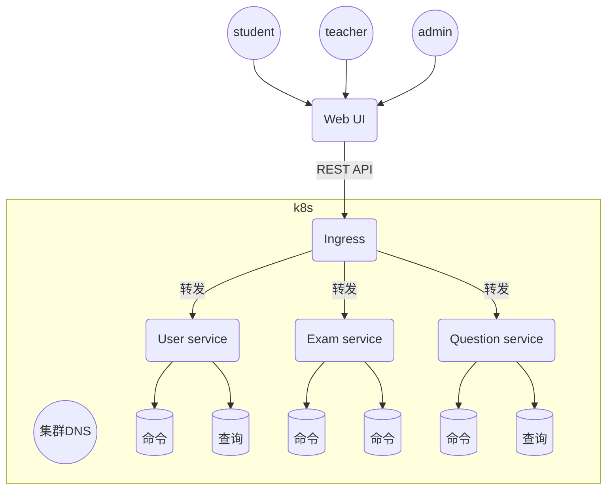

### 7.2 服务间调用

* 由于目前系统功能较为简单，服务间调用关系也较为简单，微服务间基本上保持相对独立，只有部分服务之间有调用关系。

* User Service 并没有调用其他服务。

* Exam Service
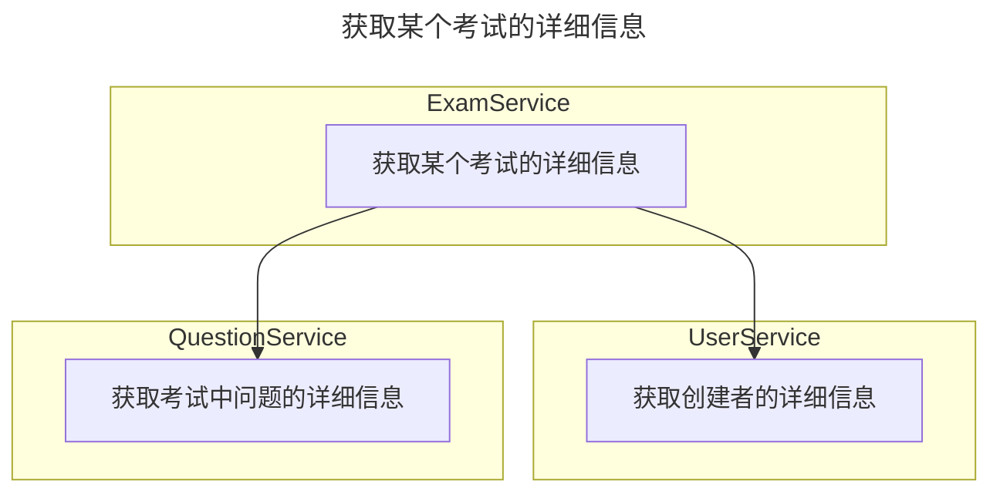

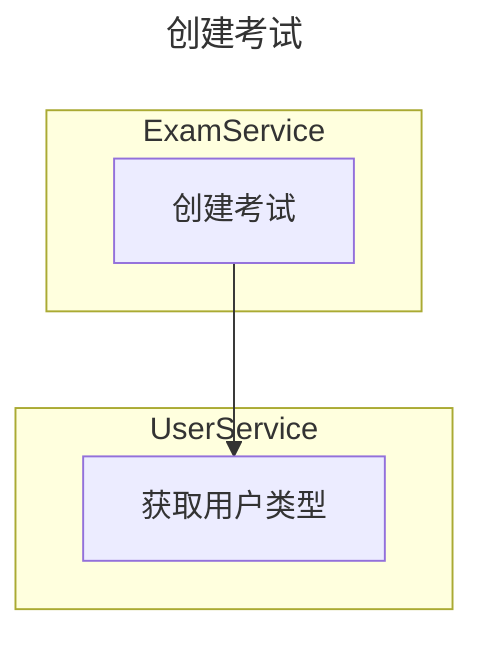

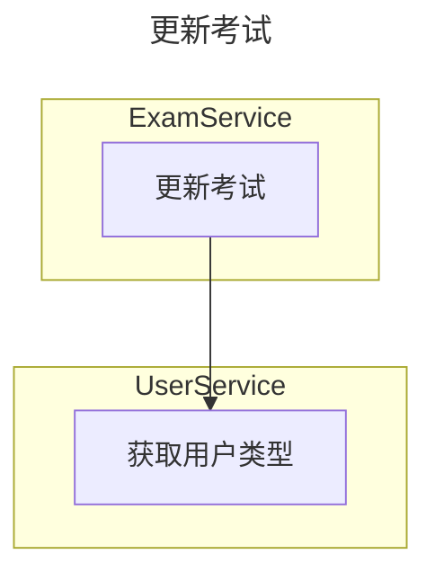

* Question Service

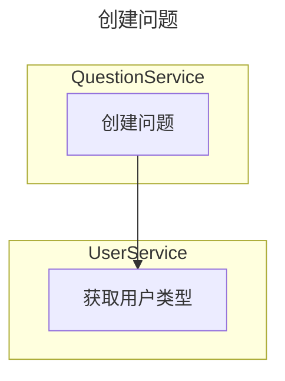

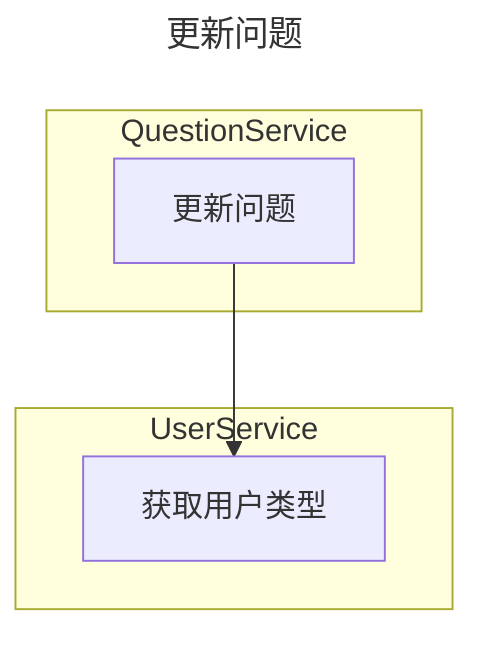

## 8. 典型用例图

### 8.1 获取考试细节

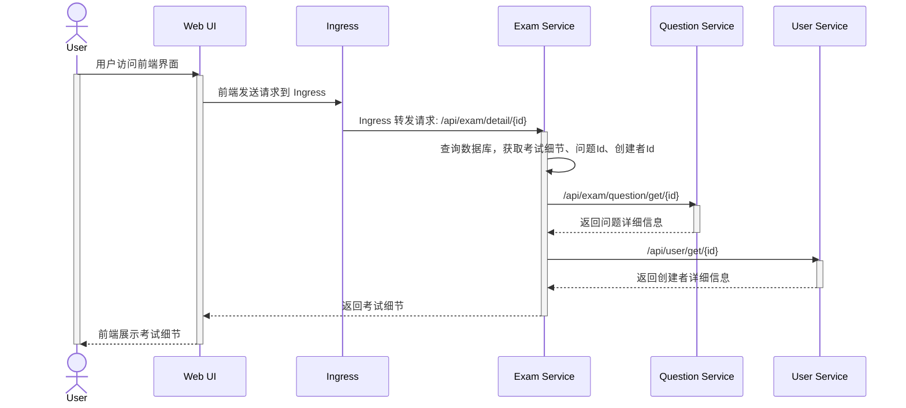

### 8.2 更新问题

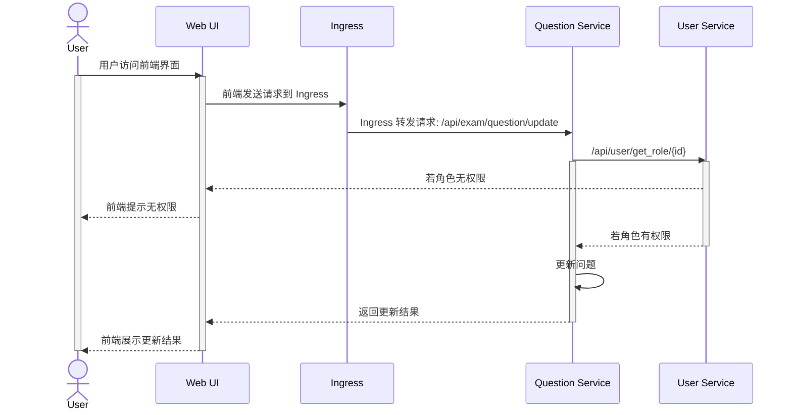
