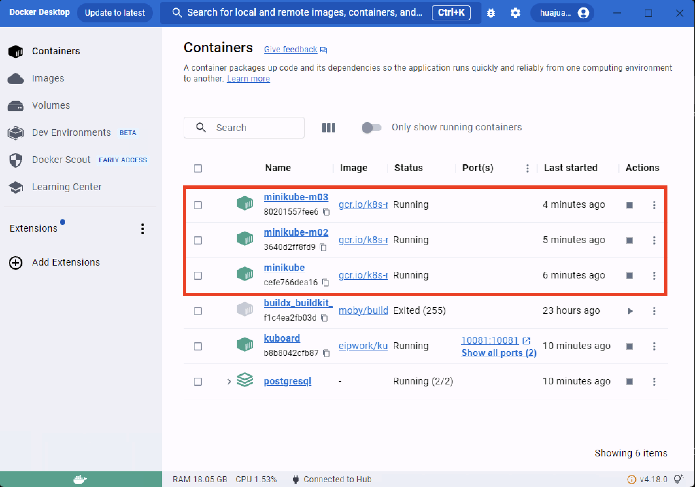
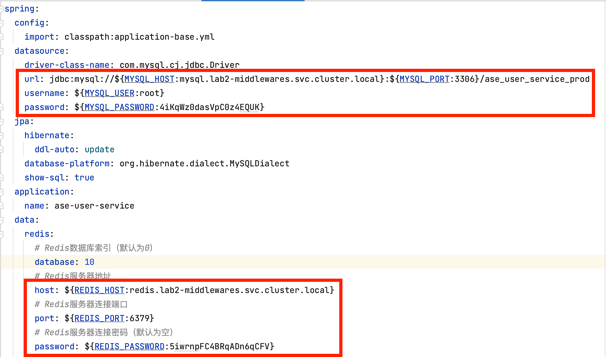
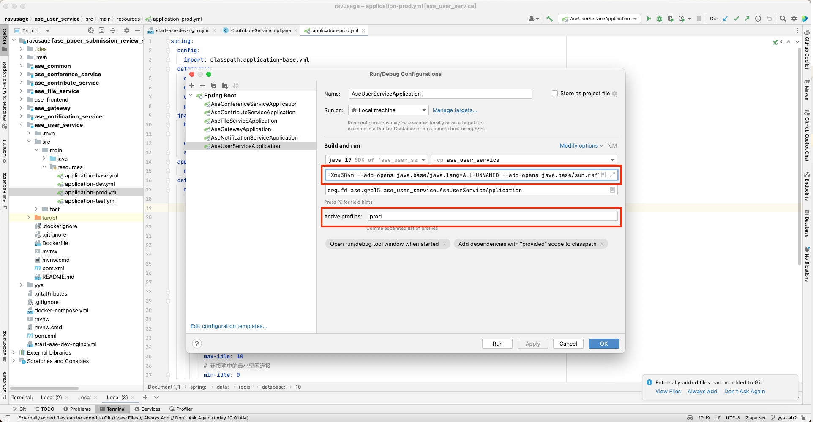
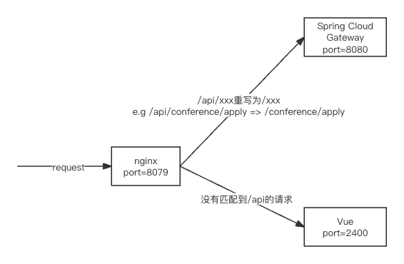
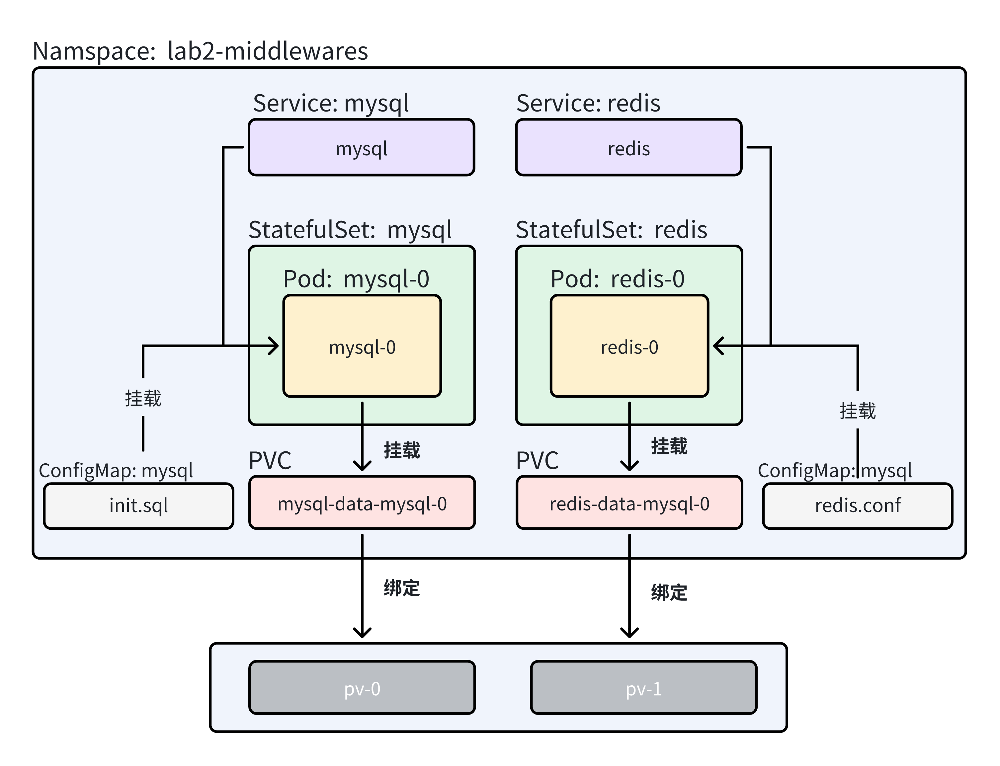
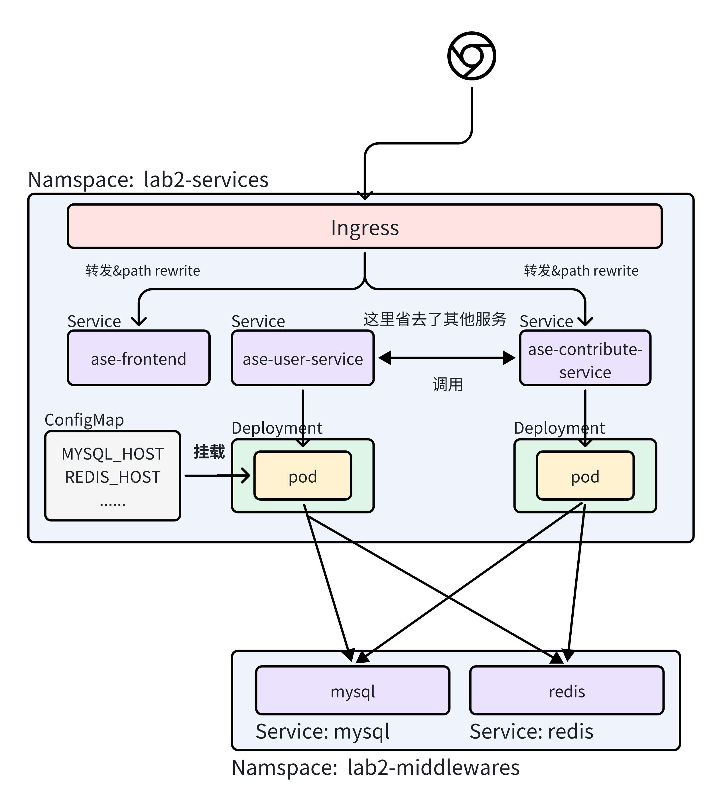

# 云原生软件技术 Lab2 Kubernetes

> 张皓捷 杨特 胡明明 王浩睿

在本次试验中，我们对Kubernetes进行实践。首先我们将会搭建一个Kubernetes集群；然后我们将会将Lab1中的应用部署到Kubernetes集群中；最后我们将学习Helm的使用，并将上述应用通过Helm进行部署。

## 0. 搭建Kubernetes集群

有以下几种方式可以搭建Kubernetes集群：

- 使用Minikube：[Minikube](https://minikube.sigs.k8s.io/docs/start/)是一个在本地运行Kubernetes的工具，它可以在单个节点上运行一个Kubernetes集群。可以用于开发、测试和本地部署。
- 使用k3d：[k3d](https://k3d.io/)是一个在Docker中运行k3s的工具，可以在本地快速搭建一个Kubernetes集群，适合用于开发、测试和本地部署。
- 使用k3s：[k3s](https://k3s.io/)是一个轻量级的Kubernetes发行版，可以在真实的多个节点（物理机或虚拟机）上运行一个Kubernetes集群，适合用于生产环境。k3s轻量且易于安装，内置了网络插件、存储插件等，可以快速搭建一个生产级别的Kubernetes集群。    
- 使用kubeadm：[kubeadm](https://kubernetes.io/docs/setup/production-environment/tools/kubeadm/create-cluster-kubeadm/)是一个用于快速部署Kubernetes集群的工具，可以在真实的多个节点（物理机或虚拟机）上运行一个Kubernetes集群，适合用于生产环境。相比于k3s，kubeadm需要手动安装网络插件、存储插件等。kubeadm安装的是原生的Kubernetes，更加灵活，但也更加复杂。

在本次试验中，我们选择使用minikube在本地搭建一个Kubernetes集群用于开发、测试和本地部署。如果你想要在真实的多个节点上搭建一个Kubernetes集群来玩一玩，建议选择k3s。

minikube支持多种驱动，包括Docker、VirtualBox、VMware等。在本次试验中，我们选择使用Docker驱动。

首先，你需要安装minikube和kubectl。你可以参考[Minikube文档](https://minikube.sigs.k8s.io/docs/start/)和[Kubernetes文档](https://kubernetes.io/docs/tasks/tools/)进行安装。kubectl是一个命令行客户端工具，用于与Kubernetes集群进行交互。

安装完成后，你可以使用以下命令启动minikube：

```bash
minikube start
```

启动完成后，你可以使用以下命令查看集群状态：

```bash
kubectl get nodes
```

你可以看到一个节点处于Ready状态，表示集群已经搭建成功。

使用以下命令向本地集群中添加节点，使之看起来更像一个真实的，具有多个节点的集群：

```bash
minikube node add
```

打开你的docker控制面板可以看到，minikube为你启动了多个容器，每一个容器对应一个节点，这些节点组成了一个Kubernetes集群。



## 1. 在本机(没有k8s)的情况下运行应用

这一步不是必须的，但可以帮助你理解这个应用如何运行，有助于你在Kubernetes集群中运行这个应用。

首先，你需要在你的机器上安装openjdk17。可以参考网上的教程进行安装。

### 1.1 应用简介

Lab2的应用和Lab1的应用在功能上完全一致。只是为了适应Kubernetes的环境，进行了如下修改：

- 不再使用nacos作为服务注册发现中心。通过Kubernetes的Service实现服务发现，服务通信与负载均衡。
- 不再使用Spring Cloud Gateway作为网关，而是使用Kubernetes的Ingress实现外部访问。
  

我们仍然使用Dubbo作为RPC框架。`@DubboReference`的配置方式有变化，如下所示：

```java
@Service
public class ContributeServiceImpl {

    @DubboReference(check = false, providedBy = "ase-user-service", providerNamespace = "lab2-services", providerPort = 20881)
    private IUserConferenceRoleService iUserConferenceRoleService;

    ......
}
```

上述的代码中，`@DubboReference`的`providedBy`属性指定了服务提供者的名称，`providerNamespace`属性指定了服务提供者的命名空间，`providerPort`属性指定了服务提供者的端口。经过上述配置后，调用`iUserConferenceRoleService`的方法时，会通过`ase-user-service.lab2-services.svc.cluster.local:20881`的地址进行RPC调用。

在Kubernetes集群中，如果你在`lab2-services`命名空间中部署了`ase-user-service`服务，那么`ase-user-service.lab2-services.svc.cluster.local`就会被k8s提供的DNS解析服务解析为`ase-user-service`服务的ClusterIP地址。随后，通过负载均衡器，请求会被转发到`ase-user-service`服务的一个Pod上。

如果你想要在没有k8s集群的情况下运行这个应用，**你需要自行配置host文件**，将`ase-user-service.lab2-services.svc.cluster.local`解析为127.0.0.1以实现服务间的通信。

```bash
➜  ~ cat /etc/hosts
##
# Host Database
#
# localhost is used to configure the loopback interface
# when the system is booting.  Do not change this entry.
##
127.0.0.1	localhost
255.255.255.255	broadcasthost
::1             localhost
127.0.0.1 ase-user-service.lab2-services.svc.cluster.local
127.0.0.1 ase-notification-service.lab2-services.svc.cluster.local
127.0.0.1 ase-conference-service.lab2-services.svc.cluster.local
127.0.0.1 ase-contribute-service.lab2-services.svc.cluster.local
127.0.0.1 ase-file-service.lab2-services.svc.cluster.local
```

### 1.2 运行应用

首先使用IntelliJ IDEA打开`ravusage`文件夹，找到每个服务的`application-prod.yaml`文件，修改其中的mysql和redis信息，使之与你的本地环境匹配。当然，你也可以通过环境变量的方式配置这些信息。

可以设置的变量如下：

- `MYSQL_HOST`：mysql的地址，默认为mysql.lab2-middlewares.svc.cluster.local，也就是在[后文](#2-在kubernetes集群中部署中间件mysqlredis)在k8s集群中部署mysql的地址
- `MYSQL_PORT`：mysql的端口，默认为3306
- `MYSQL_USERNAME`：mysql的用户名，默认为root
- `MYSQL_PASSWORD`：mysql的密码
- `REDIS_HOST`：redis的地址，默认为redis.lab2-middlewares.svc.cluster.local，也就是在[后文](#2-在kubernetes集群中部署中间件mysqlredis)在k8s集群中部署redis的地址
- `REDIS_PORT`：redis的端口，默认为6379
- `REDIS_PASSWORD`：redis的密码



随后，运行`ase-user-service`、`ase-notification-service`、`ase-conference-service`、`ase-contribute-service`、`ase-file-service`这五个服务。因为我们现在没有Ingress，所以还需要启动`ase-gateway`（Spring Cloud Gateway）作为后端服务的网关。

启动时，使用以下jvm参数：

```bash
-Xmx384m --add-opens java.base/java.lang=ALL-UNNAMED --add-opens java.base/sun.reflect.generics.reflectiveObjects=ALL-UNNAMED --add-opens java.base/java.math=ALL-UNNAMED
```



随后，启动前端页面。进入`ase-frontend`文件夹，运行以下命令：

```bash
npm install && npm run dev
```

最后，启动一个nginx作为反向代理。运行以下命令：

```bash
docker compose -f start-ase-dev-nginx.yml up
```



现在，你可以访问`http://localhost:8079`使用这个应用了。在无k8s运行时，流量会被nginx代理到Vue Dev Server或Spring Cloud Gateway。Spring Cloud Gateway会将请求转发到具体后端服务。

## 2. 在Kubernetes集群中部署中间件（mysql、redis）

在Kubernetes集群中，我们可以使用StatefulSet来部署中间件，如mysql、redis等。StatefulSet是一个控制器，用于管理有状态的应用，如数据库。StatefulSet保证了Pod的唯一性，Pod的网络标识符和持久卷的标识符是固定的，Pod的重启后，这些标识符不会改变。

可以参考以下的视图，在`lab2-middlewares`命名空间中部署mysql和redis。



以下要点可供参考：

- 使用StatefulSet部署mysql和redis。设置replicas为1，即只部署一个Pod实例。
- 创建两个PersistentVolume(PV)，分别用于存储mysql和redis的数据。可以将PV的数据存储在某个节点的本地磁盘上。在StatefulSet中，通过volumeClaimTemplates声明PersistentVolumeClaim(PVC)，PVC会自动绑定到PV上。
- 使用ConfigMap存储mysql时启动时的初始化sql脚本和redis的配置文件，并将其挂载到Pod的文件系统中。
- 使用Service将mysql和redis的Pod暴露为ClusterIP服务，供其他服务访问。
- 可以使用openEBS开源组件实现自动PVC挂载，避免手动管理PV，将PVC与PV通过storageclass解耦。

init.sql的参考内容如下：

```sql
create database if not exists `ase_user_service_prod`;
create database if not exists `ase_notification_service_prod`;
create database if not exists `ase_conference_service_prod`;
create database if not exists `ase_contribute_service_prod`;
```

redis.conf的参考内容如下：

```conf
bind 0.0.0.0
protected-mode no
daemonize no
requirepass 5iwrnpFC4BRqADn6qCFV
appendonly yes
```

## 3. 在Kubernetes集群中部署服务

在Kubernetes集群中，我们可以使用Deployment来部署应用。Deployment是一个控制器，用于管理无状态的应用。因为我们的应用的数据都存储在mysql和redis中，java程序本身不持有任何状态，所以我们可以使用Deployment来部署我们的应用。使用Deployment部署应用时，可以设置replicas为多个，即部署多个Pod实例，实现扩容和负载均衡。

在Kubernetes集群中，Ingress是一个控制器，用于管理外部访问。Ingress可以将外部流量路由到Kubernetes集群中的Service。Ingress可以实现负载均衡、SSL终止、主机和路径路由等功能。

可以参考以下的视图部署所有的服务。



需要使用的镜像已经全部打包完成并上传到了Docker Hub：

- `huajuan6848/ase_user_service:yys-lab2`: 用户服务，http端口8081，dubbo(rpc)端口20881
- `huajuan6848/ase_notification_service:yys-lab2`: 通知服务，http端口8082，dubbo(rpc)端口20882
- `huajuan6848/ase_conference_service:yys-lab2`: 会议服务，http端口8083，dubbo(rpc)端口20883
- `huajuan6848/ase_contribute_service:yys-lab2`: 投稿服务，http端口8084，dubbo(rpc)端口20884
- `huajuan6848/ase_file_service:yys-lab2`: 文件服务，http端口8085
- `huajuan6848/ase_frontend:yys-lab2`: 前端，是一个nginx容器，serve一个build好的前端页面


### 3.1 创建Deployment与Service

以下要点可供参考：

- 可以为每个服务(e.g 投稿服务、会议服务)创建一个Deployment和一个Service。在Service中，需要正确地声明http和rpc端口，以便其他服务可以访问。
- 对于文件服务，可以设置Pod指定调度到某个固定的节点，并将Pod内的/root/upload路径挂载到节点的某个目录上，以实现文件的持久化存储。
- 你可以创建一个ConfigMap保存配置，例如mysql和redis的地址、端口、用户名、密码等信息。在Deployment中，可以通过环境变量的方式引用这些配置。（理论上，你也可以使用Secret保存这些密码等敏感信息，但在这个试验中，我们不要求使用Secret，有兴趣的同学可以自行尝试。）
  

在k8s集群中，如果一个Pod需要访问另一个服务，可以使用“<service-name>.<namespace>.svc.cluster.local”这个地址进行访问。这个地址会由k8s提供的DNS解析服务解析为<namespace>命名空间中的<service-name>服务的ClusterIP地址。例如，可以通过"mysql.lab2-middlewares.svc.cluster.local"访问mysql服务；通过"ase-user-service.lab2-services.svc.cluster.local"访问用户服务。对于服务间(e.g 投稿服务和会议服务）的调用，我们已经在[应用简介](#11-应用简介)中提到过这一点。对于服务调用redis和mysql，你可以通过配置Pod的`MYSQL_HOST`和`REDIS_HOST`等环境变量来实现。

### 3.2 创建Ingress 

#### 3.2.1 安装Ingress Nginx Controller

如果你用的是minikube，你需要启用Ingress插件。可以使用以下命令启用Ingress插件：

```bash
minikube addons enable ingress
```

如果你用的是其他方法安装的Kubernetes集群，你可以先检查是否已经安装了Ingress-Nginx Controller。可以使用以下命令检查：

```bash
kubectl get pods -n ingress-nginx
```

如果没有安装，可以参考[Ingress-Nginx文档](https://kubernetes.github.io/ingress-nginx/deploy/)进行安装。

#### 3.2.2 创建Ingress资源

参照[上文](#3-在kubernetes集群中部署服务)中的图和以下提示来编写Ingress资源：

- 如果匹配到`/api/user/xxx`，则将url重写为`/user/xxx`，并将请求转发到`ase-user-service`
- 如果匹配到`/api/notification/xxx`，则将url重写为`/notification/xxx`，并将请求转发到`ase-notification-service`
- 如果匹配到`/api/conference/xxx`，则将url重写为`/conference/xxx`，并将请求转发到`ase-conference-service`
- 如果匹配到`/api/contribute/xxx`，则将url重写为`/contribute/xxx`，并将请求转发到`ase-contribute-service`
- 如果匹配到`/api/file/xxx`，则将url重写为`/file/xxx`，并将请求转发到`ase-file-service`
- 如果以上都不匹配，则不重写url，将请求转发到`ase-frontend`

可以参考这个官方文档：[Rewrite | Ingress-Nginx Controller](https://kubernetes.github.io/ingress-nginx/examples/rewrite/)

### 3.3 访问系统

执行`kubectl get svc -n ingress-nginx`，可以看到名字为`ingress-nginx-controller`的Service。

```bash
➜  ravusage git:(yys-lab2) ✗ kubectl get svc -n ingress-nginx
NAME                                 TYPE        CLUSTER-IP       EXTERNAL-IP   PORT(S)                      AGE
ingress-nginx-controller             NodePort    10.106.111.237   <none>        80:30271/TCP,443:30114/TCP   3d16h
ingress-nginx-controller-admission   ClusterIP   10.105.21.245    <none>        443/TCP                      3d16h
```

我们将这个Service的80端口映射到本地，就可以通过本地访问Ingress，从而访问我们的应用。

```bash
kubectl port-forward svc/ingress-nginx-controller -n ingress-nginx 80:80
```

之后，在浏览器中访问`http://localhost`，如果你的Ingress，Deployment和Service配置正确，你应该可以正常使用这个应用了。

### 3.4 服务扩容与负载均衡测试

我们在会议服务中人为地使用了bucket4j来限制每个用户的访问频率。在这个服务中，我们可以通过扩容会议服务的Pod实例数量来测试服务扩容与负载均衡。

bucket4j配置使用了令牌桶算法。每个用户都有一个capacity为8的令牌桶，每1/3秒产生一个令牌。每次http请求会消耗一个令牌。如果令牌桶为空，会返回429状态码。

以下为`ase_conference_service`的bucket4j配置，可以在会议服务的`application-prod.yaml`中找到：

```yaml
bucket4j:
  enabled: true
  filters:
    - cache-name: rate-limit-buckets
      url: /conference/.*
      strategy: first
      http-response-body: "{ \"status\": 429, \"error\": \"Too Many Requests\", \"message\": \"You have exhausted your Request Quota\" }"
      http-status-code: TOO_MANY_REQUESTS
      rate-limits:
        - cache-key: "getCookies().?[name == 'satoken'].length > 0 ? getCookies().?[name == 'satoken'][0].value : 'default'" # 使用SpEL获得请求中的token，作为限流的key。每一个token（用户）对应一个限流桶
          execute-condition: "true" # 限流条件，这里是无条件限流
          bandwidths:
            # bucket4j限流规则：令牌桶的容量为8，每秒钟充入3个令牌。采用GREEDY策略，即每1/3秒就会充入一个令牌，而不是等到1秒后一次性充入3个令牌
            - unit: seconds
              time: 1
              capacity: 8
              refill-speed: GREEDY
              refill-capacity: 3
```

在`yys/lab2/load-test`文件夹中，提供了一个简单的脚本`load-test.py`。这个脚本会启动10个线程，每个线程循环访问会议服务500次，随后统计平均每秒能成功访问（没有被限流）的次数。脚本设置了平均每秒成功访问次数为5次的threshold，如果平均每秒成功访问次数低于这个值，脚本会打印出警告。

首先，你需要根据实际情况修改脚本中的`TEST_USERNAME`和`TEST_PASSWORD`，以及`BASE_URL`。随后，你可以运行以下命令：

```bash
➜  load-test git:(yys-lab2) ✗ python3 load-test.py 
2024-04-08 15:10:18,936 - __main__ - INFO - Total success request count: 62
2024-04-08 15:10:18,936 - __main__ - INFO - Total time: 18.256520986557007 seconds
2024-04-08 15:10:18,936 - __main__ - WARNING - QPS is too low: 3.3960468177728402
```

如果你遇到QPS过低的警告，可以尝试扩容会议服务的Pod实例数量，然后再次运行脚本，观察QPS是否有所提升。**你应该确保最后交上来的内容能通过这个测试。**

```bash
➜  load-test git:(yys-lab2) ✗ python3 load-test.py                          
2024-04-08 15:12:51,561 - __main__ - INFO - Total success request count: 370
2024-04-08 15:12:51,562 - __main__ - INFO - Total time: 28.948517084121704 seconds
2024-04-08 15:12:51,562 - __main__ - INFO - QPS: 12.781311005493453 is acceptable
```

## 4. 使用Helm部署应用

在lab1中，当部署 Docker 应用时，通过逐条执行 Docker 命令行确实有些麻烦。使用 Docker Compose 可以实现一键部署。

而当部署自己编写的 Kubernetes 应用时，通过逐条执行 kubectl apply 命令同样会感到不便，在卸载应用时也是。这样也很难对资源进行统一管理。而 Helm Chart 可以很好地解决这个问题。

在这一步，我们将把之前编写的Kubernetes yaml文件（资源）打包成Helm Chart，并使用Helm部署应用。这样任何人都可以通过一句 helm install 命令和一个配置文件来一键部署您的应用。

作为一名合格的开发者，学会阅读官方文档是必不可少的。由于官方 Helm Chart 教程已经非常详细，而且有中文版指南，因此我们建议你自己阅读并实践。

你编写的Helm Chart应该满足如下的要求：

- 包含[3-在kubernetes集群中部署服务](#3-在kubernetes集群中部署服务)中创建的所有资源，包括Deployment、Service、Ingress、ConfigMap等。不需要包含中间件的部署。
- 注意各个yaml之间的依赖关系以及在helm chart中template的先后加载方式。
- 用户启动Helm Chart时，应该可以通过values.yaml文件或者命令行参数配置以下信息，并提供默认值。
  - 用户服务、通知服务、会议服务等5个服务的具体镜像版本。
  - mysql和redis的信息，如host、port、username、password等。
  - 每个服务对应deployment下pod的副本数。
  - 其他你觉得适合自定义的参数，并在实验报告中说明原因。


## 5. 提交内容

你需要提交的内容如下：

- [mysql和redis的部署](#2-在kubernetes集群中部署中间件mysqlredis)：提交编写好的yaml文件，包括StatefulSet、PersistentVolume、ConfigMap等。
- [服务的部署](#3-在kubernetes集群中部署服务)：提交编写好的yaml文件，包括Deployment、Service、Ingress、ConfigMap等。
- [helm部署](#4-使用helm部署应用)：提交编写好的Helm Chart。
- 实验报告：实验报告应该包括但不限于以下内容：
  - 小组成员信息及分工 
  - Kubernetes集群的搭建过程
  - yaml文件和Helm Chart的使用方法，即如何使用你们的提交的yaml和Helm Chart部署应用
  - 服务扩容与负载均衡测试的过程与结果截图
  - 实验过程记录，遇到的问题和解决方法
  - 每个小组成员单独的实验总结
  
## 6. 评分标准

- mysql和redis的部署：20%
- 服务的部署：30%
- 服务扩容与负载均衡测试：10%
- Helm Chart编写与部署：30%
- 实验报告：10%

## 7. 截止时间

2024年5月3日 23:59